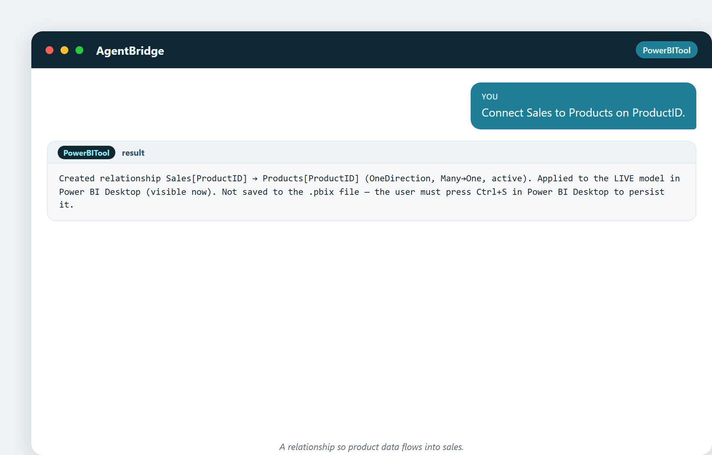
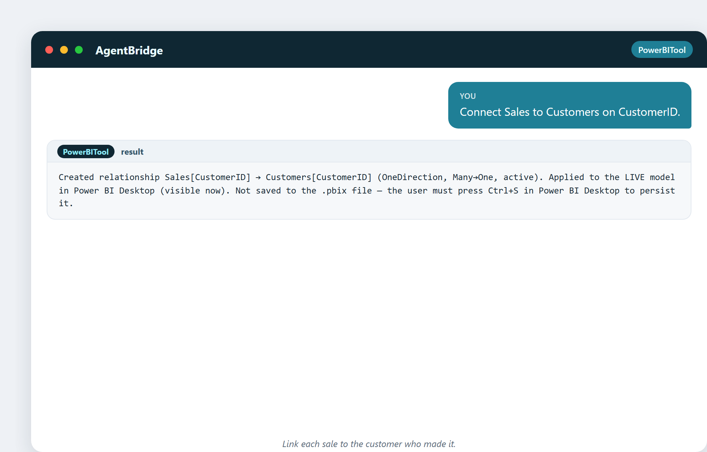
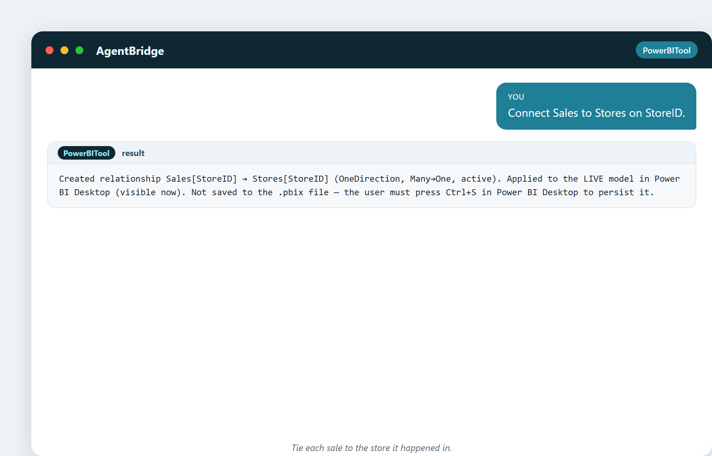
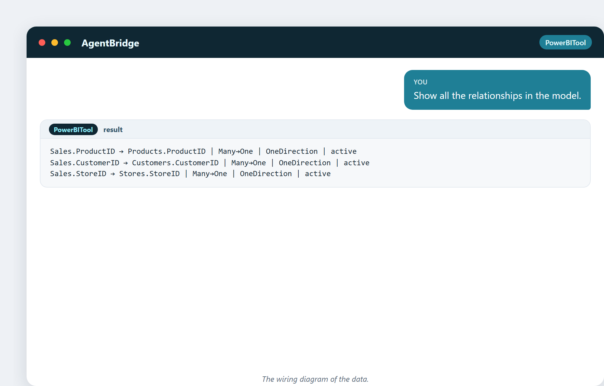
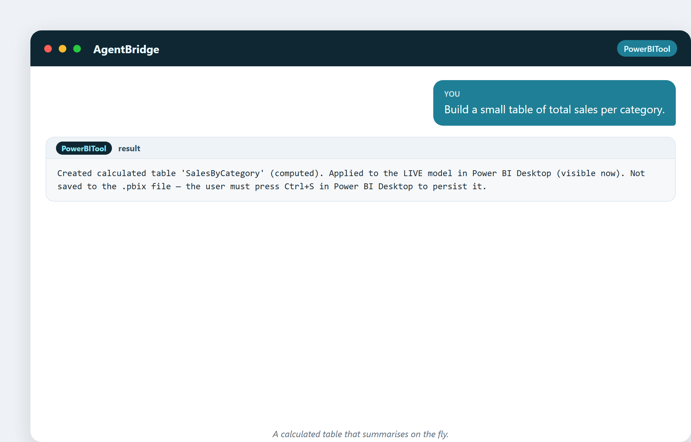
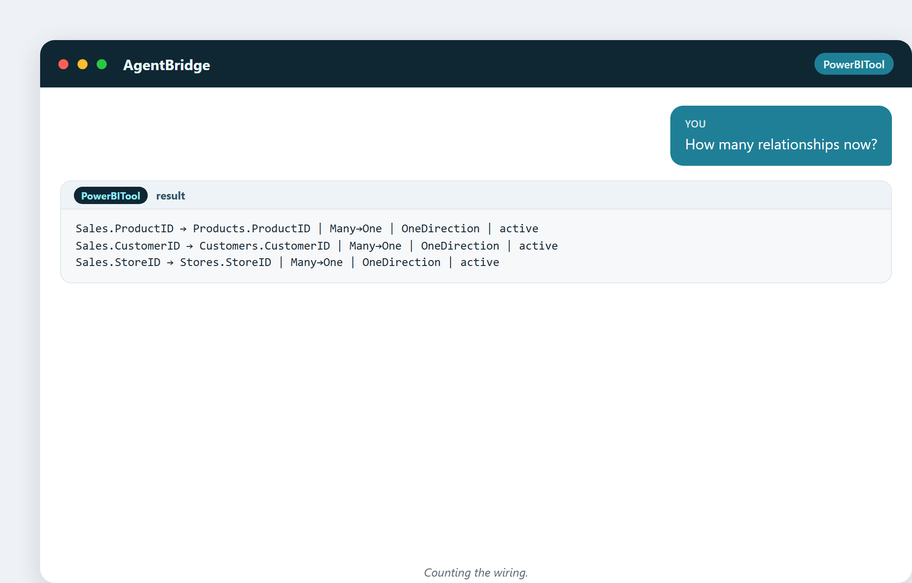

# 8. Modelle, Tabellen und Beziehungen

Ein Haufen Tabellen ist kein Modell. Ein **Modell** entsteht, wenn man dem Computer
sagt, wie die Tabellen *miteinander zusammenhängen*. Diese Verbindungen – die
Verdrahtung – sind es, die dich eine Frage an einer Stelle stellen und eine Antwort
bekommen lassen, die sich über viele Tabellen spannt. Dieses Kapitel handelt von
dieser Verdrahtung.

## Tabellen, Zeilen und Schlüssel

Jede Tabelle hat **Zeilen** (je ein Datensatz) und **Spalten** (je ein Attribut).
Die Magie steckt im **Schlüssel** – einer Spalte, die jede Zeile eindeutig
identifiziert. Eine Kunden-ID, ein Produktcode, eine Bestellnummer. Schlüssel sind,
wie Tabellen einander wiedererkennen.

- Ein **Primärschlüssel** ist die eindeutige ID in einer Tabelle (eine Zeile pro
  Kunde).
- Ein **Fremdschlüssel** ist eine Spalte in einer anderen Tabelle, die auf diese ID
  zeigt (jeder Verkauf speichert die Kunden-ID).

## Die Beziehung: Wie zwei Tabellen miteinander reden

Eine **Beziehung** verbindet einen Fremdschlüssel mit einem Primärschlüssel. Sind
sie verbunden, kann der Computer Fragen beantworten, die über Tabellen hinweggehen:
„Welches Produkt war in diesem Verkauf?" „In welcher Stadt lebte dieser Kunde?" –
ohne dass du je Dateien von Hand zusammenführst.

Die häufigste Art ist **viele-auf-eins**: viele Verkäufe zeigen auf ein Produkt.
Jeder Verkauf hat eine Produkt-ID; die Produkttabelle hat eine Zeile pro Produkt.
Viele Verkäufe, ein Produkt. Das ist das Rückgrat fast jedes Geschäftsmodells.

## Live verdrahten

Hier erstellt der Assistent eine Beziehung aus einer schlichten Anfrage:

> „Verbinde Sales mit Products über ProductID."

Das Werkzeug meldet die Richtung (Many→One) und bestätigt, dass sie in Power BI
Desktop live ist. Dann die Kunden-Verbindung:

> „Verbinde Sales mit Customers über CustomerID."

Und die Store-Verbindung:

> „Verbinde Sales mit Stores über StoreID."

Drei Sätze, und das Modell hat jetzt ein Rückgrat. Jede spätere Frage nach „Umsatz
nach Produkt", „Umsatz nach Kunde", „Umsatz nach Filiale" funktioniert wegen
dieser drei Zeilen.

## Die ganze Verdrahtung sehen

> „Zeig alle Beziehungen im Modell."

Drei saubere Many→One-Beziehungen, alle aktiv. Das ist der Verdrahtungsplan – das
Ding, das du zuerst prüfst, wenn eine Zahl falsch aussieht.

## Das Sternschema: die Form, die du willst

Zusammengezogen ergibt das die berühmteste Form in Geschäftsdaten: das
**Sternschema** (Star Schema). Eine Faktentabelle in der Mitte (Sales), umgeben von
Dimensionstabellen (Products, Customers, Stores, Date). Die Faktentabelle enthält
die Zahlen; die Dimensionen enthalten das beschreibende Detail. Aufgezeichnet sieht
es aus wie ein Stern.

Warum ist es so geliebt? Weil es einfach, schnell ist und zu dem passt, wie Leute
Fragen stellen. „Umsatz nach Kategorie" ist nur die Faktentabelle, die hinüber zur
Produkt-Dimension greift. Fast jedes gute BI-Modell ist ein Stern, oder ein Feld
voller Sterne.

## Eine berechnete Tabelle: zusammenfassen im Vorbeigehen

Manchmal will man eine kleine Zusammenfassungstabelle, gebaut aus dem Modell selbst:

> „Bau eine kleine Tabelle mit dem Gesamtumsatz pro Kategorie."

Eine neue Tabelle, live berechnet, die das Detail zu einer sauberen Zusammenfassung
aufrollt. Praktisch für einen schnellen Bericht oder eine Momentaufnahme.

## Eine Kuriosität: die Viele-viele-Falle

Die gefährlichste Beziehung ist **viele-auf-viele** ohne Sorgfalt – viele Produkte
in vielen Aktionen, viele Schüler in vielen Kursen. Macht man es falsch, verdoppeln
oder verschwinden die Summen. Die Lösung ist eine „Brückentabelle" in der Mitte.
Wenn deine Zahlen plötzlich aufgeblasen aussehen, ist ein schlampiges Viele-viele
der erste Verdächtige.

---

## Probier es selbst

> „Wie viele Beziehungen sind es jetzt?"

Ein schneller Check, ob die Verdrahtung ganz da ist.

## Was du aus diesem Kapitel mitnimmst

- Ein Modell ist Tabellen plus die Beziehungen zwischen ihnen.
- Schlüssel (Primär- und Fremdschlüssel) sind, wie Tabellen einander wiedererkennen.
- Viele-auf-eins ist das Rückgrat von Geschäftsdaten.
- Das Sternschema ist die Form, die man normalerweise will.
- Hüte dich vor schlampigem Viele-viele – es bläht Summen auf.

Als Nächstes: die Daten direkt befragen – SQL und DAX, die zwei Sprachen, um
Antworten zu bekommen.
