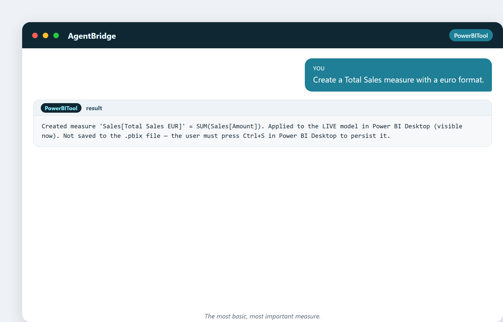
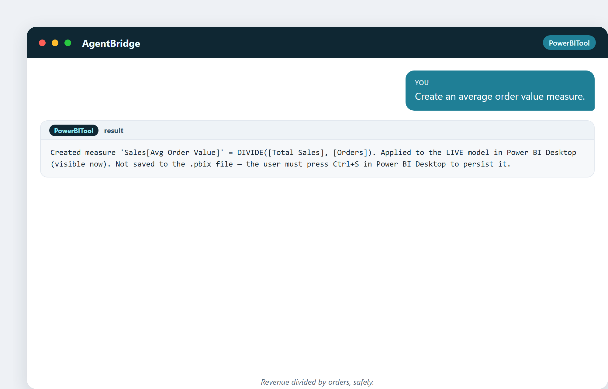
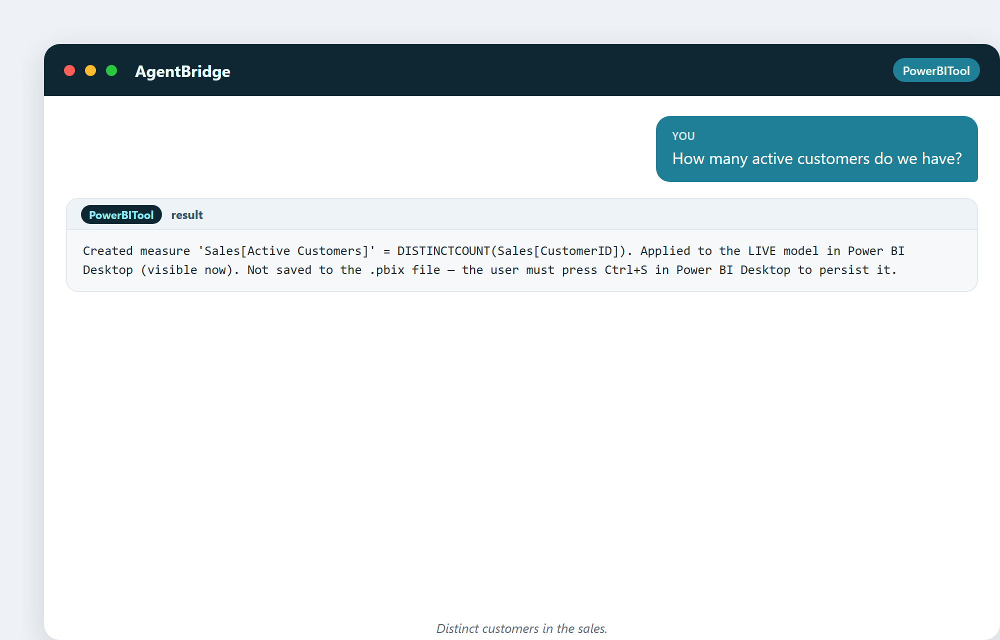
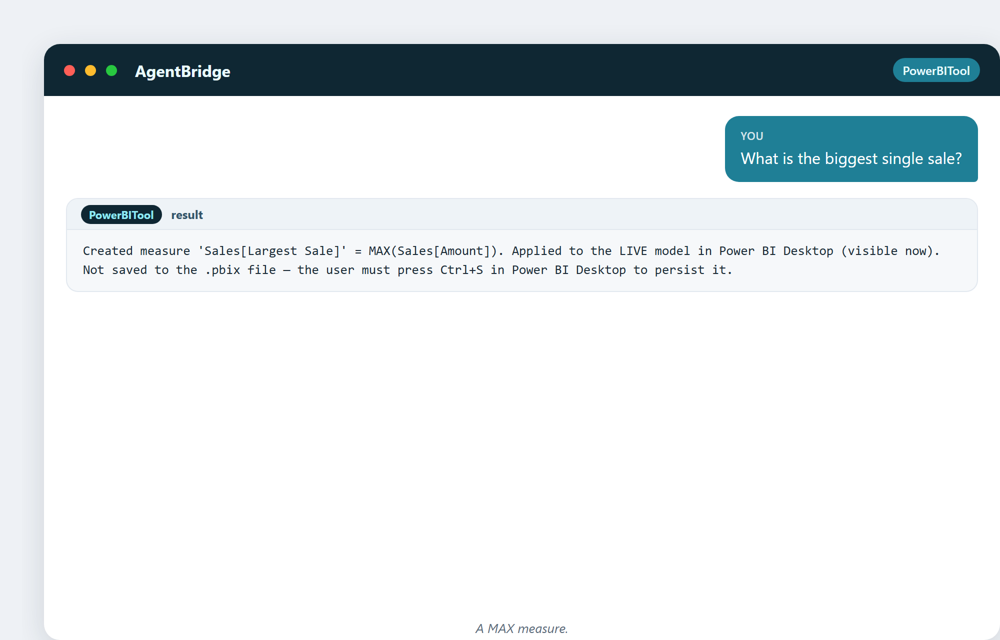
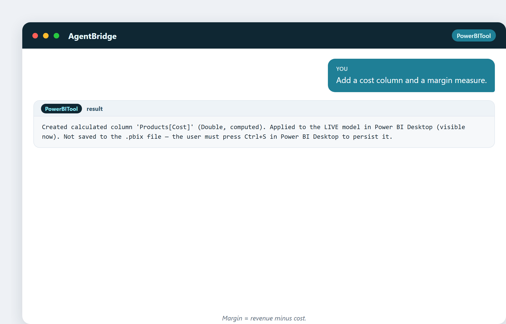
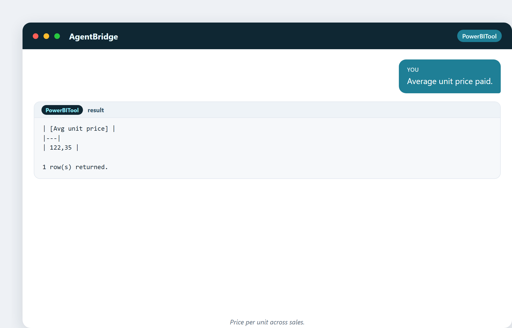

# 11. Die Kennzahlen, die zählen

Eine Kennzahl ist eine Zahl, die man beobachtet, um zu wissen, wie es dem Geschäft
geht. Wählt man die richtigen, kann man steuern. Wählt man die falschen, kann man
geradewegs von einer Klippe fahren, während das Dashboard grün leuchtet. Dieses
Kapitel handelt davon, die Zahlen auszuwählen, die wirklich zählen – und sie mit dem
Assistenten zu bauen.

## Was eine Kennzahl beobachtenswert macht

Eine gute Kennzahl besteht drei Tests:

1. **Sie bewegt sich, wenn sich das Geschäft bewegt.** Wird das Geschäft schlechter,
   sollte die Zahl schlechter werden.
2. **Man kann etwas mit ihr anfangen.** Eine Zahl, die man nur bewundern kann, ist
   Deko.
3. **Sie ist ehrlich.** Sie kann nicht so getrimmt werden, dass sie gut aussieht,
   während die Dinge fault.

Eine **Eitelkeitskennzahl** fällt durch. „Die Gesamtzahl der registrierten Nutzer
seit 2010" geht nur nach oben. Fühlt sich großartig an, bedeutet nichts. Beobachte
Raten und Veränderungen, nicht immer weiter wachsende Summen.

## Die zentralen Vertriebs-Kennzahlen

Jedes Geschäft, das Dinge verkauft, beobachtet einen ähnlichen Satz:

- **Gesamtumsatz** – der wichtigste Umsatz.
- **Verkaufte Stück** – wie viel Ware bewegt wurde.
- **Bestellungen** – wie viele Transaktionen.
- **Durchschnittlicher Bestellwert** – Umsatz pro Bestellung.
- **Aktive Kunden** – wie viele Leute tatsächlich gekauft haben.
- **Größter Verkauf** – die größte einzelne Position (zum Finden von Walen).

Der Assistent baut jede davon aus einer schlichten Anfrage. Sieh, wie ein Satz
entsteht:

> „Erstelle ein Maß Gesamtumsatz mit Euro-Format."

> „Erstelle ein Maß für verkaufte Stück."

> „Erstelle ein Maß für den durchschnittlichen Bestellwert."

Beachte: Der durchschnittliche Bestellwert nutzt `DIVIDE`, nicht einen
Schrägstrich. Das ist Absicht – `DIVIDE` behandelt den Fall, in dem der Nenner
null ist, ohne abzustürzen. Eine kleine Sicherheitsangewohnheit, die dich später vor
`#DIV/0!`-Fehlern bewahrt.

> „Wie viele aktive Kunden haben wir?"

> „Was ist der größte einzelne Verkauf?"

In ein paar Sätzen existiert der ganze zentrale KPI-Satz, live im Modell.

## Geld-Kennzahlen: Marge und Anteil

Umsatz ist Eitelkeit, Gewinn ist Verstand. Um zu wissen, was du *behältst*,
brauchst du Kosten:

> „Füge eine Kostenspalte und ein Marge-Maß hinzu."

> „Gesamtmarge über alle Verkäufe."

Und um zu sehen, wie sich eine Scheibe zum Ganzen verhält:

> „Anteil am Gesamtumsatz, als Prozentzahl."

Ein Prozent-vom-Gesamten ist eine der meistgenutzten Kennzahlen im Reporting – sie
macht aus jeder Zahl „wie groß ist das im Vergleich zu allem?".

## Noch ein paar schnelle

> „Durchschnittlich bezahlter Stückpreis."

> „Gesamtumsatz ohne eine Kategorie."

Jede ein schlichter Satz, jede ein echtes Maß im Live-Modell.

## Eine Kuriosität: die Kennzahl, die nach hinten losging

Als die Sowjetunion die Nagelproduktion nach **Stückzahl** maß, stellten Fabriken
winzige unnütze Nägel millionenweise her. Als sie auf **Gewicht** umstellten,
machten sie ein paar riesige Nägel. Gleiches Ziel, andere Kennzahl, andere
Absurdität. Die Lehre, die jeder Analyst lernen muss: **Man bekommt, was man misst**,
also miss mit Bedacht – idealerweise eine Kennzahl, die sich nur verbessern kann,
wenn das Geschäft sich wirklich verbessert.

---

## Was du aus diesem Kapitel mitnimmst

- Wähle Kennzahlen, die sich mit dem Geschäft bewegen, mit denen du etwas anfangen
  kannst, die man nicht tricksen kann.
- Vermeide Eitelkeitskennzahlen (immer wachsende Summen).
- Der zentrale Vertriebs-Satz: Umsatz, Stück, Bestellungen, Durchschnittsbestellung,
  aktive Kunden.
- Marge und Anteil-am-Ganzen verwandeln Umsatz in Bedeutung.
- Man bekommt, was man misst – miss weise.

Als Nächstes: die vier Arten von Analyse, von „was ist passiert" bis hin zu „was
sollten wir tun".
