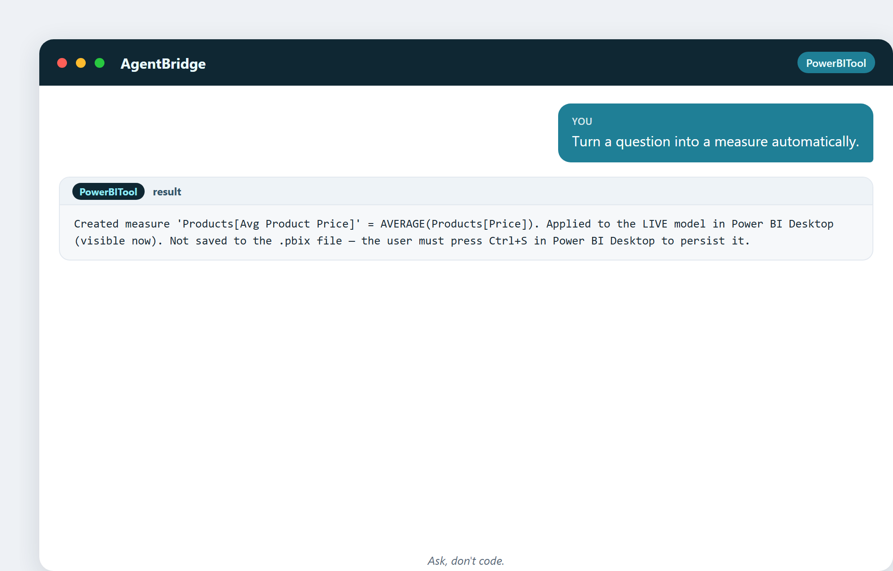
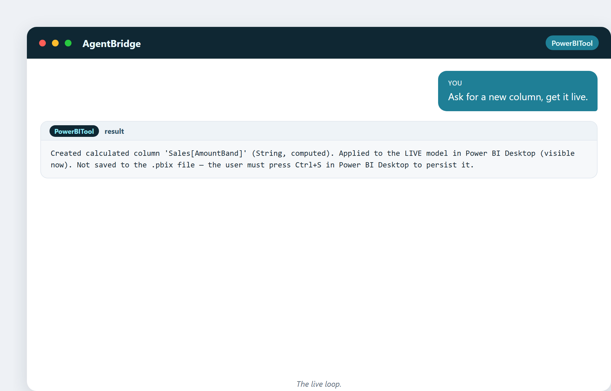

# 22. Der Aufstieg des KI-Assistenten

Alles in diesem Buch hat auf diesen Moment hingearbeitet: ein Werkzeug, das eine
Frage in ganz normaler Sprache hört und die ganze analytische Arbeitskette für dich
erledigt. Dieses Kapitel handelt davon, was sich geändert hat, und warum es
wichtiger ist, als es zuerst klingt.

## Der alte Weg: eine Kette manueller Schritte

Jahrzehnte lang bedeutete es, eine Geschäftfrage in Power BI zu beantworten, eine
Kette manueller Schritte: das Werkzeug öffnen, die Tabelle finden, das DAX
schreiben, auf Fehler prüfen, das Maß erstellen, formatieren, zu einem Visual
hinzufügen, wiederholen. Jeder Schritt brauchte eine Fähigkeit, und die Kette
brauchte Zeit. Der Engpass war nie die Frage – es war das Tun.

## Der neue Weg: die Antwort beschreiben

Jetzt beschreibst du die Antwort, die du willst, und der Assistent erledigt die
Kette:

> „Frag in ganz normaler Sprache, krieg eine echte Modelländerung."

> „Mach aus einer Frage automatisch ein Maß."

Die Kette, die einen fähigen Analysten eine Weile kostete, passiert jetzt in einem
Satz. Die Fähigkeit wandert vom *Ausführen der Schritte* zum *die richtige Frage
stellen*.

## Warum das größer ist als „Autovervollständigung"

Das ist keine Autovervollständigung. Autovervollständigung hilft dir, schneller zu
tippen. Der Assistent hier **versteht die Absicht und bedient das Werkzeug** – er
verbindet sich mit dem Modell, schreibt korrektes DAX, wendet die Änderung live an
und meldet, was er tat. Das ist der Unterschied zwischen einer schnelleren
Tastatur und einem fähigen Kollegen.

> „Bitte um eine neue Spalte, bekomm sie live."

> „Ein Satz, eine echte Änderung, sofort sichtbar."

## Der agentische Wandel

Das Wort dafür ist **agentisch**: Die Software trifft *Aktionen* auf ein Ziel hin,
nicht nur Antworten auf Fragen. Du gibst ihr ein Ziel („füge ein
Kitchen-Umsatz-Maß hinzu"), und sie handelt – verbinden, berechnen, anwenden,
bestätigen. Ein Agent schließt die Schleife zwischen Absicht und Ergebnis.

Deshalb fühlen sich die Beispiele in diesem Buch anders an als ein Tutorial. Jedes
ist eine echte Aktion auf einem echten Modell, getan von einem Agenten, sichtbar auf
einem echten Bildschirm.

## Was das für den Analysten bedeutet

Die Angst ist, dass der Assistent den Analysten ersetzt. Die Realität ist
interessanter: Er **entfernt die Plackerei und hebt das Urteilsvermögen.** Der
Analyst hört auf, Stunden mit Syntax zu verbringen, und fängt an, Zeit mit den
Fragen zu verbringen, die zählen – welche Fragen stellen, welchen Antworten trauen,
was als Nächstes tun. Der Assistent ist ein Kraftverstärker für einen guten
Analysten und eine Tür für einen neugierigen Nicht-Analysten.

## Eine Kuriosität: das Jevons-Paradox der Analyse

Wenn etwas billiger wird, nutzen wir mehr davon, nicht weniger. Ökonomen nennen das
das **Jevons-Paradox**. Wenn Analyse so einfach wird, werden wir nicht weniger
Analyse machen – wir werden enorm viel mehr machen. Fragen, die „die Mühe nicht
wert" waren, werden gratis. Die Welt wird nicht weniger Analysten brauchen; sie wird
Analysten brauchen, die einer sofort antwortenden Maschine bessere Fragen stellen
können.

## Der ehrliche Vorbehalt

Ein Assistent ist nur so gut wie seine Prüfungen. Dieser hier validiert DAX, schützt
vor gefährlichen Operationen und meldet genau, was er geändert hat – denn ein
Agent, der ohne zu prüfen handelt, ist eine Belastung, kein Helfer. Vertrau dem
Assistenten, wie du einem sorgfältigen Kollegen vertraust: voll und ganz, aber mit
immer sichtbaren Belegen.

---

## Was du aus diesem Kapitel mitnimmst

- Der alte Weg war eine lange manuelle Kette; der neue Weg ist eine beschriebene
  Antwort.
- Das ist Aktion, nicht Autovervollständigung – der Agent bedient das Werkzeug.
- „Agentisch" heißt, er schließt die Schleife von Absicht zu Ergebnis.
- Er entfernt die Plackerei und hebt das Urteilsvermögen.
- Billigere Analyse heißt mehr Analyse, nicht weniger (Jevons).

Als Nächstes: lerne die zwei Werkzeuge hinter jedem Beispiel in diesem Buch kennen.
