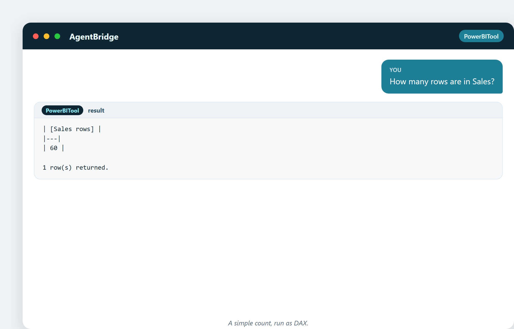
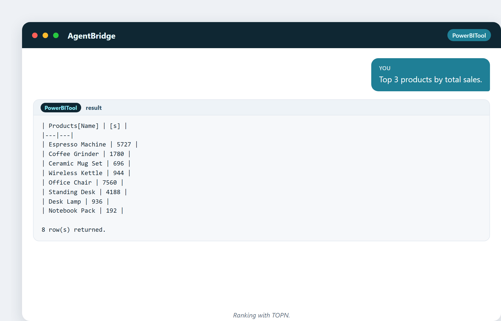
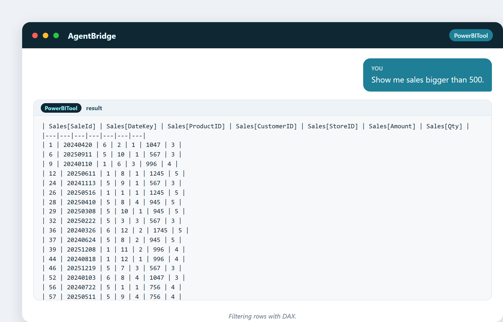
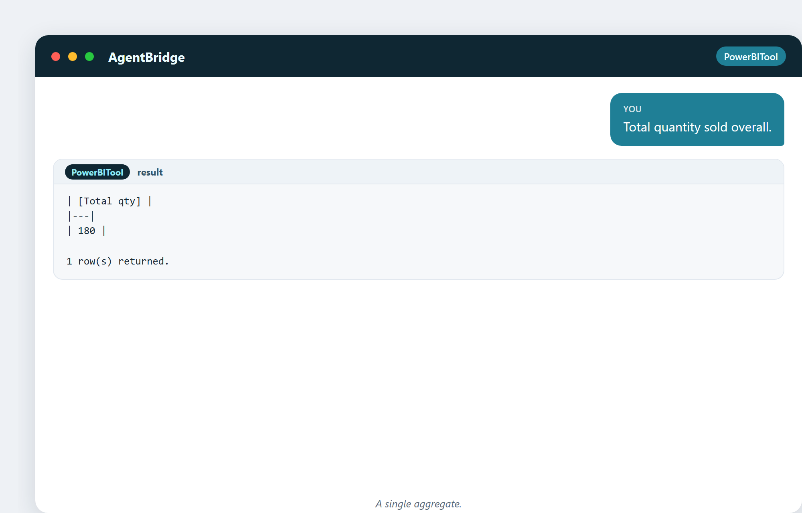
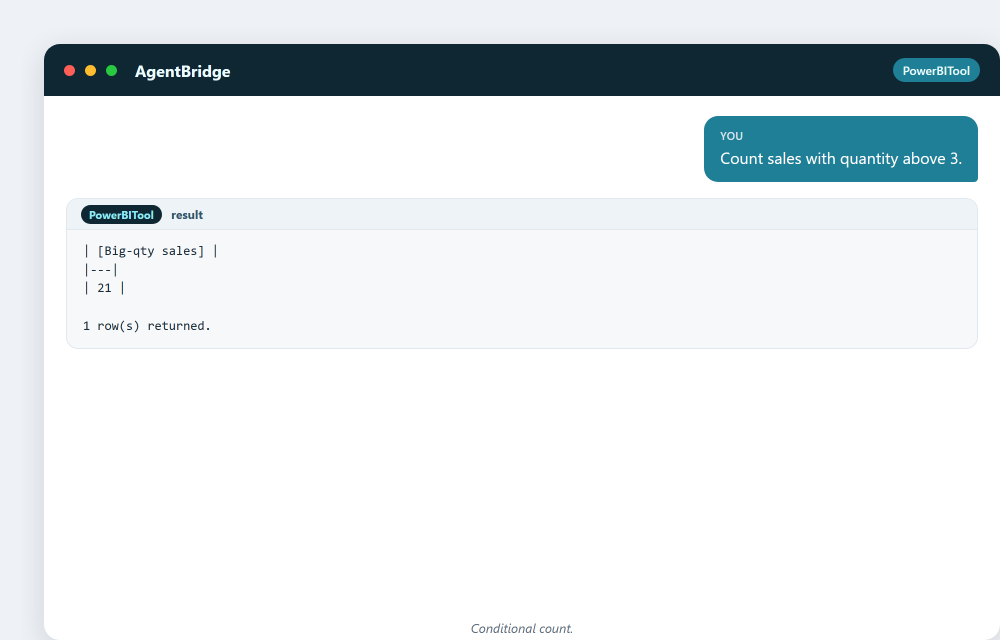

# 9. Asking Questions with SQL and DAX

Once the data is in and wired up, you ask it questions. There are two languages you
should recognise: **SQL** for databases, and **DAX** for Power BI. You do not need
to write them by hand anymore — the assistant does — but you should understand what
they do, so you can ask well and read the answers.

## SQL: the language of databases

**SQL** (Structured Query Language) has been the way to talk to databases since the
1970s. It reads almost like English:

- `SELECT` — which columns you want
- `FROM` — which table
- `WHERE` — which rows to keep
- `GROUP BY` — how to bundle and total

A classic: *"total sales by region"* is a SELECT, a JOIN to the region table, and a
GROUP BY. SQL is everywhere — if your company has a database, SQL is how you read
it.

## DAX: the language of Power BI

**DAX** (Data Analysis Expressions) is the language inside Power BI. It looks
different from SQL but does the same job: ask for a number, get a number. DAX is
built around **measures** — named calculations you can reuse. `SUM`, `AVERAGE`,
`COUNT`, `CALCULATE` are its workhorses.

The beautiful thing: you do not have to type DAX. You describe the answer you want,
and the assistant writes and runs the DAX for you. Let's watch.

## Counting and summing

> "How many rows are in Sales?"

Sixty sales records. Simple, instant.

> "What is the total of the Amount column?"

€22,023 in total sales. The kind of number that used to mean a pivot table and ten
minutes; now it's one sentence.

## Ranking and filtering

> "Top 3 products by total sales."

The assistant ranks them for you. (Note how it returns the full ranking so you can
see the whole picture, not just the top slice.)

> "Show me sales bigger than 500."

A filter, run live, returning every big sale. This is how you find the outliers and
the whales.

## Grouping across a relationship

> "Total sales by store city."

This is the moment the model pays off: the assistant reaches across the
Sales→Stores relationship and totals by city, no manual merge needed.

## Pulling a related value

> "For each sale, show the product name."

Using `RELATED`, the assistant pulls the product name onto each sale — the kind of
thing that in Excel means a VLOOKUP and a prayer.

## A few more, because they're easy

> "Total quantity sold overall."

> "Count sales with quantity above 3."

Each one a plain sentence, each one a real DAX query run against the live model.

## A curiosity: DAX's scary reputation

DAX has a reputation for being hard. It is not hard to *use* — it is hard to
*master the filter context*, the subtle rule about what data a calculation sees at
any moment. But here is the secret of this book: you don't have to master it. You
describe the answer; the assistant writes the DAX and handles the context. The
difficulty moves from your shoulders to the tool's.

---

## What you'll carry from this chapter

- SQL talks to databases; DAX talks to Power BI.
- Both read close to English: select, filter, group, total.
- You describe the answer; the assistant writes and runs the query.
- Relationships make cross-table questions trivial.
- The hard part of DAX is now the tool's problem, not yours.

Next: the spreadsheet — where everyone starts, and the wall where everyone needs
something more.
