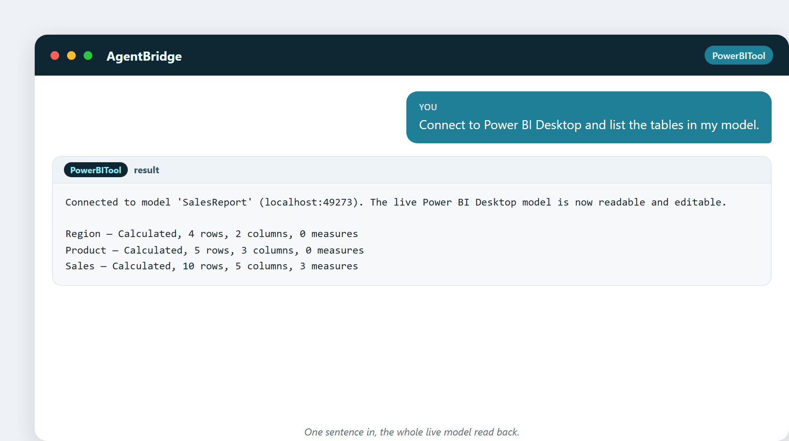

# 1. Lo que realmente hace un analista de datos

Pregúntale a diez personas qué hace un analista de datos y obtendrás diez respuestas
distintas. Unas se lo imaginan en una habitación oscura escribiendo código verde.
Otras se lo imaginan haciendo tartas de datos bonitas. Ambas están equivocadas, y
ninguna lo está. Aclaremos el asunto.

Un analista de datos es una persona que responde preguntas usando números. Ese es
todo el trabajo. Las preguntas vienen de la vida real: *¿Por qué bajaron las ventas
el mes pasado? ¿Qué producto deberíamos empujar? ¿Qué clientes están a punto de
irse?* Las respuestas vienen de los datos: los registros que un negocio deja atrás
cada día: ventas, clics, facturas, tickets de soporte, tiempos de entrega.

La habilidad del analista no son las matemáticas. Es la **traducción**. Convierte
una pregunta humana difusa en una pregunta precisa sobre los datos, encuentra la
respuesta y la vuelve a convertir en una frase que un gestor ocupado pueda usar.

## El trabajo en una línea

> Un analista de datos convierte una pregunta enredada del mundo real en una
> respuesta clara y honesta respaldada por números.

Todo lo demás —las herramientas, los gráficos, el código— es solo la forma de
llegar ahí.

## Un día en la vida

Imagina un martes. A las 9:00 el jefe de ventas deja caer una pregunta en la
bandeja del analista: *«¿Por qué nuestra tienda de Milán está un 12% abajo este
mes?»*

Esa sola frase son en realidad cinco preguntas:

- ¿El 12% es real, o un capricho de cómo se contaron los números?
- ¿Es solo Milán, o otras tiendas también están abajo?
- ¿Qué cambió este mes: precio, stock, clima, un competidor abriendo al lado?
- ¿La caída está en el número de clientes, o en lo que gasta cada cliente?
- ¿Qué podríamos hacer realmente al respecto?

El analista rebusca entre registros de ventas, datos de clientes y todo lo demás
que pueda explicarlo. Para por la tarde tiene una respuesta: *el tráfico a pie cayó
porque una carretera estuvo cerrada por obras dos semanas; los clientes que sí
vinieron gastaron lo de siempre.* Nada de misterio. Una carretera.

Ese es el trabajo. Curiosidad, un poco de método y los datos.

## Los cuatro primos (y en qué se diferencian)

La gente confunde cuatro trabajos cercanos. Aquí va la versión simple.

| Rol | A qué se dedica sobre todo | La pregunta que responde |
|---|---|---|
| **Analista de datos** | Mira lo que ya pasó y lo explica | «¿Qué pasó y por qué?» |
| **Científico de datos** | Construye modelos para predecir o adivinar | «¿Qué pasará después?» |
| **Ingeniero de datos** | Construye las tuberías que mueven y guardan datos | «¿Cómo traemos aquí datos limpios?» |
| **Analista de BI** | Construye paneles e informes que la gente mira | «¿Cómo lo vemos cada día?» |

Hay mucha superposición. En una empresa pequeña, una persona hace los cuatro papeles.
Pero el terreno propio del analista de datos es la primera columna: entender el
presente y el pasado reciente.

## Dónde trabaja el analista

En todas partes. Unas cuantas formas reales del trabajo:

- **Comercio minorista** — por qué cayeron las ventas de una tienda; qué productos
  se venden juntos.
- **Banca** — vigilar transacciones buscando patrones que parezcan fraude.
- **Comercio electrónico** — dónde abandonan los compradores el carrito, y por qué.
- **Fabricación** — qué turno o línea saca más piezas defectuosas.
- **Software (SaaS)** — cuántos suscriptores se quedan, y qué los hace irse.

Distintos edificios, mismo trabajo: hacer una pregunta, encontrar los números, decir
la verdad.

## Una curiosidad: el analista más antiguo

El análisis de datos es miles de años más antiguo que los ordenadores. Los antiguos
egipcios enviaban escribas a contar la cosecha y el ganado para poder planificar
impuestos y reservas de grano antes de una hambruna. Esos escribas eran analistas
de datos. La hoja de cálculo es nueva; el trabajo es antiguo.

---

## Pruébalo: ver un modelo en una frase

Basta de teoría. Aquí tienes tu primer contacto con la herramienta sobre la que
está construido este libro. En AgentBridge, con PowerBITool, una persona escribió
una frase sobre un informe de Power BI que ya tenía abierto en pantalla:

> «Conéctate a Power BI Desktop y lista las tablas de mi modelo.»

Esto es lo que devolvió:

En una línea, el asistente leyó el modelo en vivo y reportó cada tabla, cuántas
filas tiene y cuántas medidas tiene. Sin pulsar menús, sin escribir código. Esa es
la forma de todo en este libro: una frase normal entra, un resultado real sale.

---

## Lo que te llevarás de este capítulo

- Un analista de datos responde preguntas reales con números.
- La habilidad central es la traducción, no las matemáticas.
- El trabajo es antiguo; las herramientas son nuevas, y cada vez más rápidas.

En el próximo capítulo viajamos atrás en el tiempo para ver cómo contar se
convirtió en una profesión.
