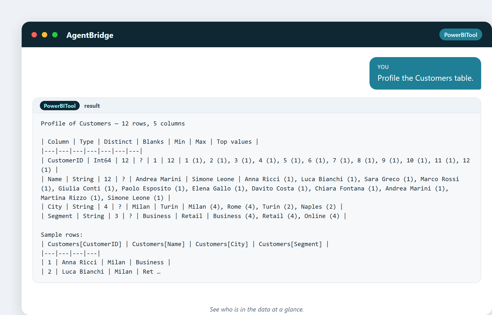

# 6. De dónde vienen los datos

Antes de poder analizar nada, necesitas datos, y necesitas saber en qué forma están.
Este capítulo trata de la materia prima: de dónde viene, las formas que adopta y
cómo tomarle la temperatura antes de construir nada.

## Tres clases de datos

Todo lo que analizarás jamás cae en tres cubos:

- **Estructurado** — filas y columnas ordenadas. Una tabla de ventas, una lista de
  clientes, un extracto bancario. Fácil de leer para los ordenadores. Este es tu pan
  de cada día.
- **Semiestructurado** — tiene algo de orden pero no una rejilla limpia. Un registro
  web, un archivo JSON de una app, un correo con campos. Necesita un poco de forma.
- **No estructurado** — sin orden incorporado. Documentos de texto, imágenes,
  vídeos, la queja en texto libre de un cliente. Lo más difícil de analizar, y donde
  la IA está poniéndose sorprendentemente buena.

La mayor parte del análisis de negocio vive en el mundo estructurado. Esa es la
buena noticia: es la clase a la que puedes apuntar con una herramienta y obtener
respuestas rápido.

## Los sospechosos habituales: dónde se esconde el dato de negocio

- **El ERP / sistema de gestión** — pedidos, facturas, stock, clientes.
- **El CRM** — prospectos, oportunidades, contactos, embudo de ventas.
- **Hojas de cálculo** — el recurso universal, para lo bueno y para lo malo.
- **Bases de datos** — servidores SQL que guardan los registros de la empresa.
- **Registros web y de apps** — cada clic, cada visita a página y cada evento.
- **Exportaciones CSV / Excel** — datos sacados de cualquier sistema a un archivo.
- **APIs** — datos en vivo que transmite un servicio (clima, envíos, pagos).
- **Sensores IoT** — temperatura, estado de máquinas, contadores de afluencia.

Un análisis real suele coser varias de estas cosas. El primer movimiento del
analista es encontrar los datos y entender su forma.

## Tomar la temperatura: el perfilado

Antes de fiarte de una tabla, la **perfilas**: cuántas filas, qué columnas, cuántos
valores distintos, cuántos huecos, el mínimo y el máximo, los valores más comunes.
El perfilado es un reconocimiento médico que te dice con qué estás tratando antes de
construir un solo gráfico.

Aquí va uno real. Una persona pidió al asistente que perfilara la tabla de productos:

> «Perfilado de la tabla Products.»

De un disparo ves: 8 productos, 3 categorías (Kitchen 4, Furniture 3,
Stationery 1), precios de €12 a €349, y unas pocas filas de muestra. Nada de
adivinar. La forma de los datos ya es obvia.

Lo mismo funciona para clientes:

> «Perfilado de la tabla Customers.»

Doce clientes en cuatro ciudades y tres segmentos. Ya puedes ver la historia
formándose: Milán y Roma son las más grandes, los segmentos están equilibrados.

## Ver las columnas con claridad

A veces solo quieres la estructura: las columnas y sus tipos. El asistente lee el
esquema directamente:

> «Muéstrame el esquema de la tabla Sales.»

Cada columna, su tipo y las medidas ya adjuntas. Este es el mapa que llevas a cada
pregunta posterior.

## Una curiosidad: la «quinta clase» de dato

Entre analistas corre el chiste de que la quinta clase de dato es **el dato que no
sabías que tenías**: los metadatos. ¿Cuándo cambió cada registro? ¿Quién lo tocó?
¿Cuántas veces se vio una página? Los metadatos son los datos *sobre* tus datos, y a
menudo guardan las respuestas más interesantes de todas.

---

## Pruébalo tú mismo

> «¿Cuántas categorías distintas hay?»

Una pregunta de una línea, una respuesta de una línea, directo del modelo en vivo.

## Lo que te llevarás de este capítulo

- Los datos vienen en tres formas: estructurado, semiestructurado, no estructurado.
- El dato de negocio se esconde en ERP, CRM, bases de datos, hojas de cálculo,
  registros y APIs.
- Perfila **siempre** antes de construir: conoce la forma y los huecos.
- No olvides los metadatos: los datos sobre tus datos.

Siguiente: el trabajo poco glamuroso y esencial de limpiar datos sucios, y cómo
unas pocas columnas calculadas arreglan un desastre en segundos.
