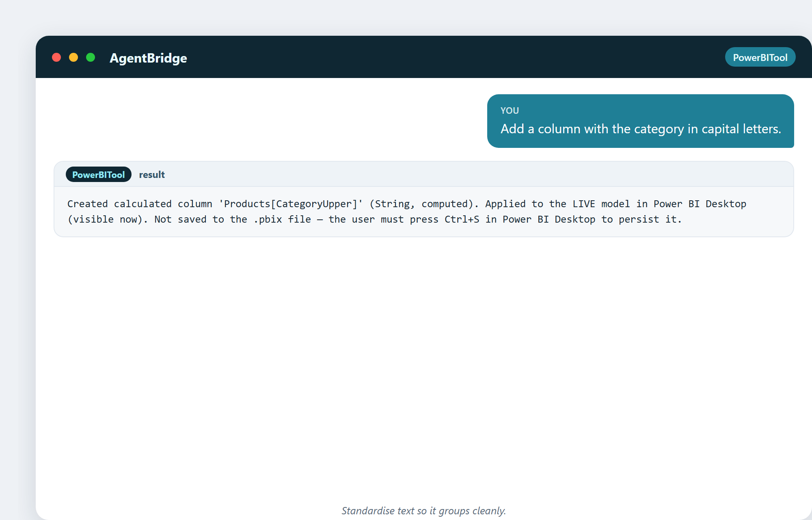
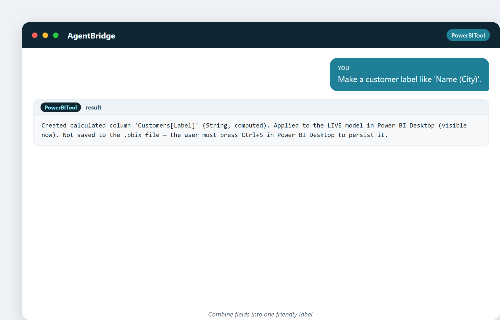
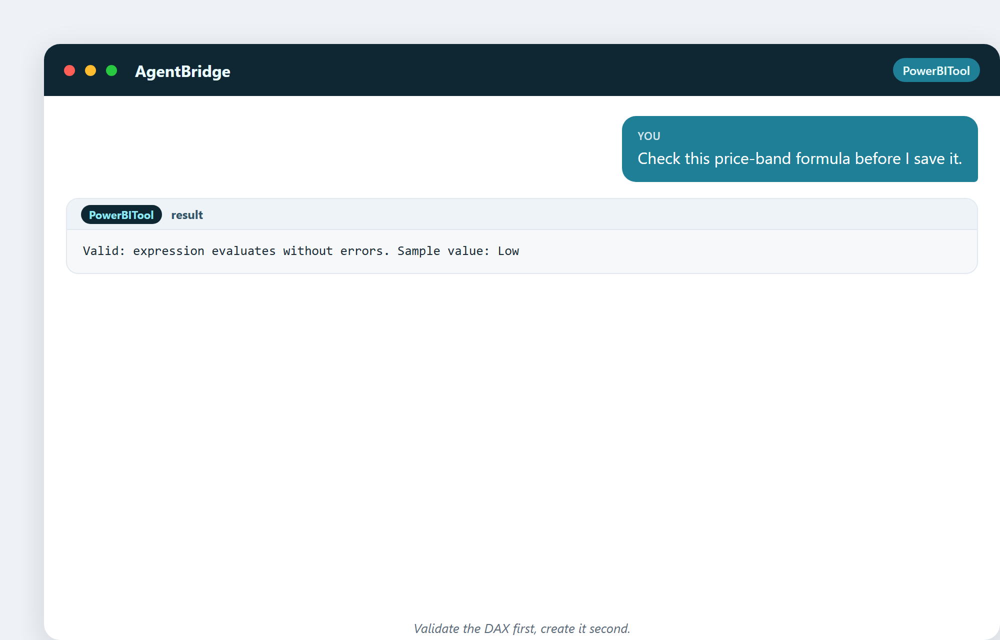

# 7. Datos sucios y cómo limpiarlos

Aquí va una verdad que nadie pone en la descripción del puesto: **la mayor parte del
tiempo de un analista se va en limpiar datos.** Los datos del mundo real son un
desorden: mal escritos, duplicados, faltantes, inconsistentes. Basura entra, basura
sale. Antes de poder encontrar ninguna verdad, tienes que barrer el suelo.

## El desorden de siempre

Todo analista se cruza con el mismo reparto de problemas:

- **Texto inconsistente** — "Milan", "milan", "MILANO", "Milano ". Cuatro valores,
  una ciudad.
- **Formatos mezclados** — fechas como 03/04/2025 y 2025-04-03 en la misma columna.
- **Valores faltantes** — ciudades en blanco, categorías vacías, sin teléfono.
- **Duplicados** — el mismo cliente dos veces con dos correos.
- **Tipos erróneos** — un número guardado como texto, así que no suma.
- **Valores fuera de lugar** — una venta negativa que en realidad es un reembolso.

Ninguno de estos es dramático. Todos arruinarán en silencio un análisis si los
ignoras.

## Limpiar con columnas calculadas

En Power BI, mucha limpieza se hace con **columnas calculadas**: nuevas columnas que
creas con una fórmula que arregla o estandariza los datos existentes. Es
exactamente donde el asistente brilla: describes el arreglo en palabras normales, y
él escribe la fórmula y la aplica en vivo.

**Estandariza el texto.** Una persona preguntó:

> «Añade una columna con la categoría en mayúsculas.»

Ahora "kitchen", "Kitchen" y "KITCHEN" todos se vuelven "KITCHEN" y se agrupan
juntos. Una pequeña columna, y toda una clase de problema desaparece.

**Convierte un número en una banda útil.**

> «Agrupa los productos en Alto / Medio / Bajo por precio.»

Un precio crudo de €249 es difícil de agrupar. Una banda «Alto» es fácil de
graficar y fácil de mencionar. Este es uno de los trucos más útiles del análisis:
convertir un número continuo en una categoría amigable.

Y esto es lo que te compra esa banda: ventas agrupadas y graficadas por banda de
precio:

**Combina campos en una etiqueta.**

> «Crea una etiqueta de cliente tipo «Nombre (Ciudad)».»

Ahora cada cliente tiene una etiqueta de visualización limpia, construida a partir de
dos columnas, sin que nadie escriba nada.

## Comprueba antes de comprometerte

Un buen hábito: **valida la fórmula antes de guardarla.** El asistente puede probar
una fórmula y mostrarte un valor de muestra, para que sepas que funciona antes de
que pase a formar parte del modelo.

> «Comprueba esta fórmula de banda de precio antes de guardarla.»

Devuelve "Valid" con un valor de muestra. Sin sorpresas después.

## Cazar los huecos

Los valores faltantes son asesinos silenciosos. Una ciudad en blanco significa que
un cliente desaparece de todos los mapas. El asistente puede cazarlos:

> «¿Hay ciudades en blanco en la lista de clientes?»

Si el resultado está vacío, estás limpio. Si no, sabes exactamente dónde están los
agujeros antes de que induzcan a error un gráfico.

## Una curiosidad: el 80/20 del trabajo

Pregúntale a cualquier analista experimentado cómo se reparte su tiempo y oirás una
versión del mismo chiste: **el 80% de la ciencia de datos es limpiar datos, y el
otro 20% es quejarse de limpiar datos.** Es un cliché porque es verdad. Los
analistas buenos limpiando valen su peso en oro: porque un modelo precioso
construido sobre datos sucios es una manera preciosa de equivocarse.

## Cuando limpiar nunca basta

A veces los datos están demasiado idos: falta el 40% de un campo clave, o dos
sistemas que simplemente no coinciden. Un buen analista sabe cuándo dejar de limpiar
y escalar: *arregla esto en el origen*, o *reúne mejores datos la próxima vez*.
Limpiar es una herramienta, no una religión.

---

## Lo que te llevarás de este capítulo

- Los datos reales están sucios; limpiar es la mayor parte del trabajo.
- Las columnas calculadas arreglan texto, crean bandas de números y etiquetas en
  segundos.
- Valida una fórmula antes de comprometerte con ella.
- Caza los huecos antes de que induzcan a error un gráfico.
- Sabe cuándo dejar de limpiar y arreglar el origen.

Siguiente: cómo se conectan las piezas de datos: tablas, claves y relaciones, el
cableado que hace posible el análisis.
