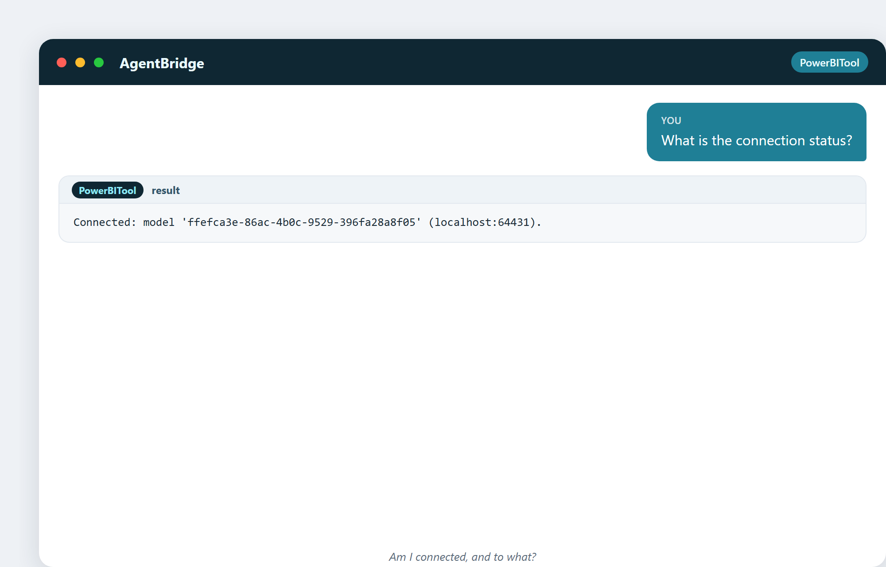

# 17. Conectarse a tus datos

Antes de que el asistente pueda hacer nada con Power BI, tiene que conectarse a él.
Este capítulo trata de ese apretón de manos: cómo el asistente encuentra tu informe
abierto, se conecta al modelo en vivo y sabe exactamente con qué está hablando.

## La conexión local

Aquí está la clave que hay que entender: Power BI Desktop, cuando abres un informe,
arranca un pequeño **motor de análisis** en tu propia máquina (un programa llamado
`msmdsrv`). El asistente se conecta a *ese* motor, en *tu* máquina.

```
You  →  AgentBridge  →  PowerBITool  →  the engine inside your Power BI Desktop
```

Sin nube. Sin subir nada. Los datos nunca salen de tu ordenador. El asistente
simplemente habla con el mismo motor que usa el propio Power BI, a través de una
puerta local.

## Encontrar lo que está abierto

El asistente puede ver cada informe de Power BI que tengas abierto, cada uno con su
propio motor y puerto:

> «¿Qué informes de Power BI están abiertos ahora mismo?»


Si tienes un informe abierto, se conecta a él directamente. Si tienes varios, le
dices cuál por su nombre. Así es como se mantiene apuntando a lo correcto.

## Confirmar la conexión

Una vez conectado, siempre puedes comprobar el estado:

> «¿Cuál es el estado de la conexión?»



Te dice en qué modelo está y en qué puerto local. Esto importa porque cada cambio
posterior va a *este* modelo en vivo. Saber exactamente a qué estás conectado es la
primera regla de la edición segura.

## Qué significa de verdad «en vivo»

Cuando el asistente cambia el modelo, el cambio ocurre en el **modelo en vivo, en
memoria** dentro de Power BI Desktop. Lo ves de inmediato: ese es el bucle de
retroalimentación visual. Pero hay una trampa importante que la herramienta siempre
te recuerda:

> El cambio está en vivo pero **no guardado en el archivo**. Para conservarlo, pulsas
> **Ctrl+S** en Power BI Desktop.

Esto es una función de seguridad, no un fallo. Significa que cada cambio es reversible
hasta que eliges guardar. Puedes experimentar libremente; nada es permanente hasta
que tú lo decidas.

## Una curiosidad: el puerto es una puerta secreta

Cada instancia de Power BI Desktop elige un puerto de red local aleatorio para su
motor: ese número en la cadena de conexión (como `localhost:64431`). El asistente
descubre este puerto automáticamente encontrando el proceso de Power BI en ejecución
y su motor hijo. Nunca tienes que saber el número; la herramienta lo averigua. Es la
misma puerta que Power BI usa internamente: el asistente solo aprendió a llamar.

## Reconectar y seguridad

Si cierras el informe y abres otro, el asistente nota que el motor cambió y te pide
reconectarte: no escribirá a ciegas en el modelo equivocado. Esta seguridad de sesión
es lo que hace fiable la edición en vivo: la herramienta comprueba que el motor detrás
de la conexión sigue siendo al que se conectó antes de dejar pasar un cambio.

---

## Lo que te llevarás de este capítulo

- El asistente se conecta al motor local dentro de tu Power BI Desktop.
- Sin nube, sin subir nada: todo se queda en tu máquina.
- Descubre informes abiertos y sus puertos automáticamente.
- Los cambios están en vivo pero no guardados hasta que pulsas Ctrl+S.
- La herramienta protege contra escribir en el modelo equivocado.

Siguiente: modelar en Power BI: el asistente como un modelador cuidadoso y bien
documentado.
