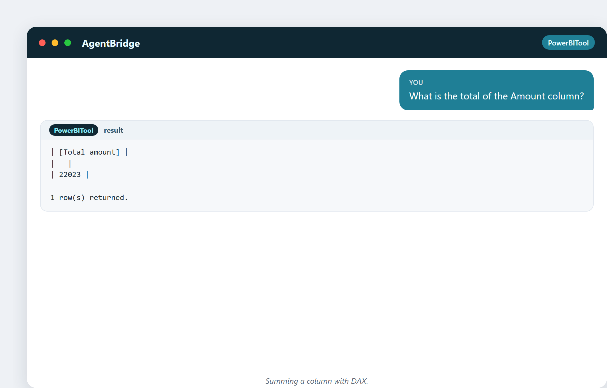

# 10. Tableurs, Excel et le mur qu'on finit par heurter

Aucun livre sur l'analyse de données ne peut faire l'impasse sur le tableur. C'est
là que presque tout le monde commence, et pour de bonnes raisons — c'est brillant.
Mais c'est aussi là qu'on bute sur un mur, et savoir où se trouve ce mur vous dit
quand il faut passer à autre chose.

## Pourquoi le tableur a gagné

Le tableur est l'un des logiciels les plus réussis jamais créés. Son génie, c'est
la **manipulation directe** : vous tapez un nombre dans une case, et les cases qui
en dépendent se mettent à jour instantanément. Pas de code, pas de compilation, pas
d'attente. Vous voyez votre travail et votre résultat côte à côte.

Les tableurs ont donné aux gens ordinaires le pouvoir de modéliser : budgets,
prévisions, plannings, listes de prix. Avant le tableur, ce pouvoir résidait
uniquement dans les mainframes, et uniquement entre les mains de programmeurs. Après
lui, n'importe qui avec un PC pouvait le faire.

## Le tableau croisé dynamique : l'analyse en boîte

Le **tableau croisé dynamique** est le super-pouvoir du tableur. Faites glisser
quelques champs et il résume des milliers de lignes : ventes par mois, par produit,
par région. Pour une part énorme de l'analyse métier, un tableau croisé dynamique
est tout le travail. Si vous savez pivoter, vous savez analyser.

## Le mur

Mais les tableurs ont un plafond, et tout analyste finit par le heurter :

- **La taille** — au-delà d'un million de lignes, Excel gémit, ralentit et plante.
- **La fragilité** — une cellule supprimée, une formule cassée, et tout le classeur est silencieusement faux. Pas de filet de sécurité.
- **Pas de relations** — relier deux tables veut dire RECHERCHEV, et RECHERCHEV casse dès que les données bougent.
- **Le chaos des versions** — « Budget_FINAL_v3_vraiment_final.xlsx » modifié par cinq personnes, toutes en désaccord.
- **Pas de rafraîchissement** — un rapport mis à jour au copier-coller chaque lundi est un rapport faux chaque mardi.
- **Pas d'histoire partagée** — un tableur est un fichier, pas un tableau de bord vivant sur lequel les autres peuvent se fier et qu'ils peuvent explorer.

Si votre lundi matin, c'est « ouvrir le fichier, coller les nouvelles données, tirer
sur les formules, sauvegarder à nouveau, envoyer par mail » — vous faites à la main
ce qu'un bon modèle fait tout seul.

## Le tableur face au modèle

Voici la différence en une ligne :

> Un tableur stocke des nombres dans des cellules. Un modèle stocke la *logique* et recalcule les nombres à chaque fois.

Dans un tableur, le nombre *est* la réponse, posée dans une cellule, qui moisit.
Dans un modèle, la réponse est recalculée à partir des données et des règles, chaque
fois que vous regardez, toujours à jour.

## La même question, de deux façons

Dans Excel, « total des ventes » veut dire une formule SOMME sur une colonne, juste
tant que personne ne touche aux lignes. Dans un modèle, c'est une mesure —
`SUM(Sales[Amount])` — qui se recalcule à la demande et peut être découpée par
n'importe quelle dimension sans une seule nouvelle formule :

> « Quel est le total de la colonne Amount ? »

Même nombre, mais maintenant il vit dans un modèle capable de répondre « par
région », « par mois », « par client » sans le moindre effort supplémentaire — parce
que c'est la logique qui est stockée, pas le résultat.

## Une curiosité : le tableur qui a perdu un milliard

En 1998, une erreur de tableur a contribué à une perte de 1,2 milliard de dollars
dans un grand fonds financier (LTCM), et d'innombrables entreprises se sont brûlées
à cause d'une seule mauvaise cellule. En 2008, un célèbre article de recherche sur
la dette et la croissance s'est révélé entaché d'une erreur de tableur — un ensemble
de lignes exclu par accident — qui inversait sa conclusion et avait influencé de
vraies politiques pendant des années. Les tableurs sont puissants, et c'est
précisément pour ça que leurs erreurs sont dangereuses. Un modèle à la logique testée
est plus sûr qu'un tableur cachant un `+` là où devrait se trouver un `-`.

## Quand rester, quand partir

Restez dans le tableur quand : les données sont petites, le travail est ponctuel,
vous faites des esquisses. Passez à un modèle quand : les données sont grosses, le
rapport se répète, plus d'une personne y touche, ou vous avez besoin qu'il soit
*juste* et *à jour*. L'assistant et Power BI sont la façon de franchir ce pont sans
douleur.

---

## Ce que vous garderez de ce chapitre

- Les tableurs sont brillants pour le travail petit, direct et ponctuel.
- Le tableau croisé dynamique est un véritable super-pouvoir.
- Le mur : la taille, la fragilité, l'absence de relations, le chaos des versions, l'impossibilité de rafraîchir.
- Un modèle stocke la logique, pas des résultats figés.
- Passez à autre chose quand le rapport se répète ou que les données grossissent.

La partie II est terminée — vous savez d'où viennent les données, comment les
nettoyer, comment les relier, et comment les interroger. Nous passons maintenant à
la transformation des données en sens : les indicateurs et les types d'analyse qui
pilotent les décisions.
