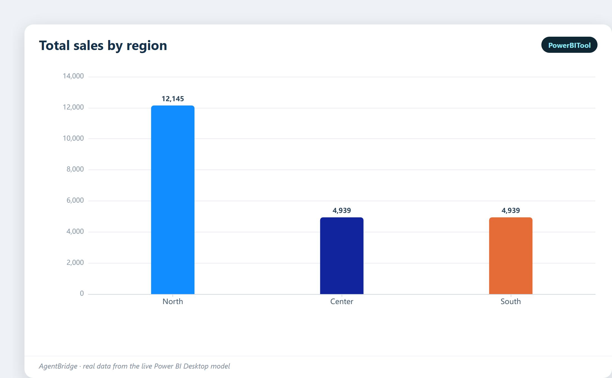
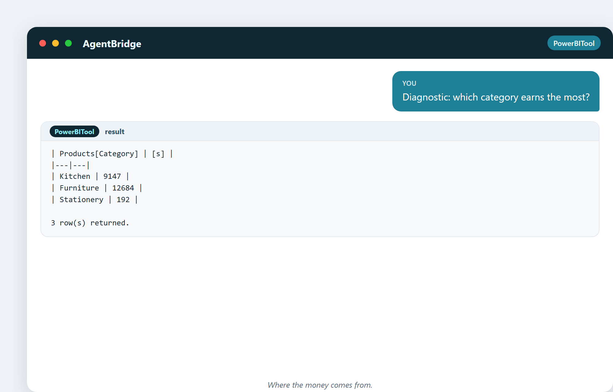
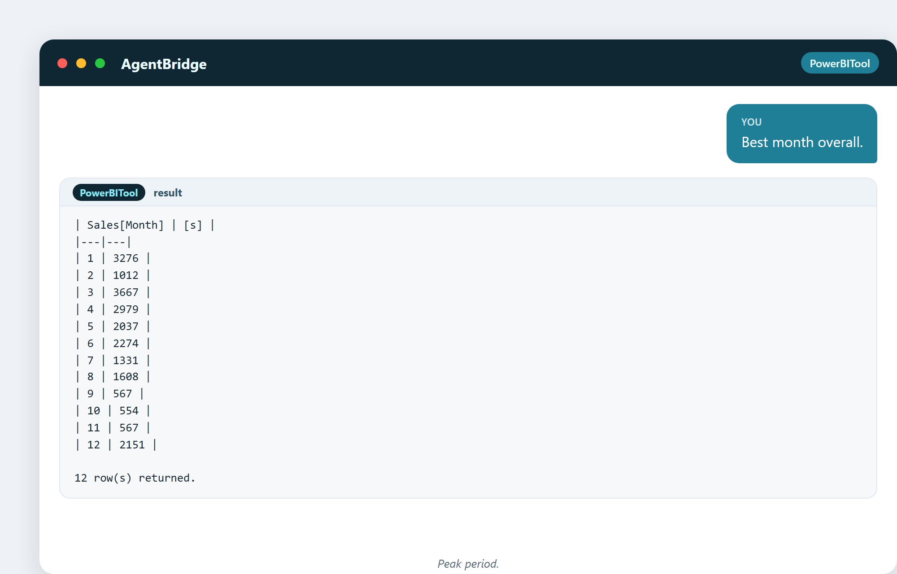
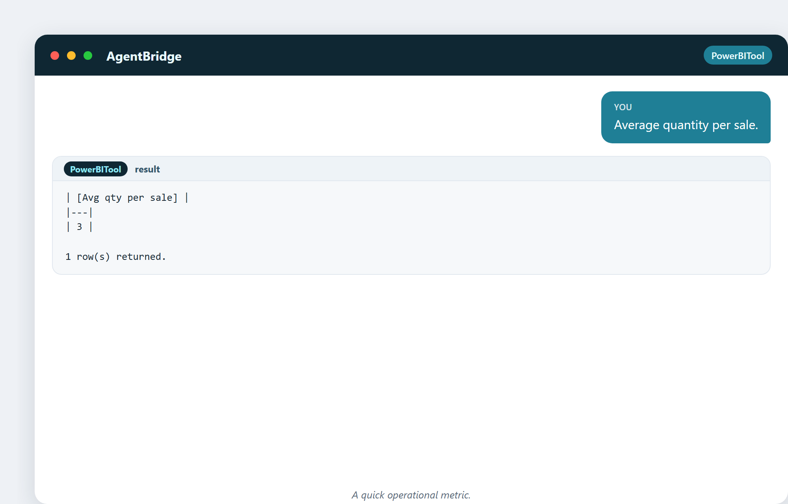

# 12. Quatre types d'analyse

Toute analyse que vous ferez un jour tombe dans l'un de quatre types, classés selon
la quantité qu'ils demandent aux données. Ils grimpent une échelle : regarder en
arrière, expliquer pourquoi, deviner en avant, recommander quoi faire. Savoir de
quel type vous êtes vous dit jusqu'où pousser et à quel point faire confiance à la
réponse.

## 1. Descriptive — que s'est-il passé ?

Le plus simple et le plus courant. Vous décrivez le passé. « Les ventes étaient de
22 023 €. Le Nord a fait 12 145 €. » Pas d'explication, pas de prédiction — rien
que les faits, clairement.

> « Descriptif : total des ventes par région. »

La plupart des tableaux de bord sont descriptifs. Ils répondent à « comment allons-
nous ? » et ils sont le socle sur lequel tout le reste repose.

La répartition régionale, en graphique :

## 2. Diagnostique — pourquoi est-ce arrivé ?

Maintenant vous creusez. Quelque chose a changé, et vous voulez la cause. Vous
découpez, comparez et croisez les références jusqu'à ce que la raison remonte à la
surface.

> « Diagnostique : quelle catégorie rapporte le plus ? »

> « Compare les ventes du Nord et du Centre. »

Le travail diagnostique est là où l'analyste gagne son pain. Le descriptif vous dit
que le patient a de la fièvre ; le diagnostique trouve l'infection.

Le même œil diagnostique posé sur les magasins :

## 3. Prédictif — que va-t-il se passer ?

Vous utilisez le passé pour deviner l'avenir. La demande du trimestre prochain,
l'attrition du mois prochain, les ventes d'ici la fin de l'année. Cela demande en
général des statistiques ou de l'apprentissage automatique, et ça vient avec une
fourchette de confiance — une bonne prédiction dit « à peu près 11 000, à peu de
chose près ».

> « Le meilleur mois dans l'ensemble. »

Une vue sur une seule période comme celle-ci est la matière première de la
prédiction : vous voyez le motif, puis vous le projetez en avant.

## 4. Prescriptif — que devrions-nous faire ?

Le haut de l'échelle. Étant donnée la prédiction et les contraintes, quelle action
maximise l'objectif ? Quel prix, quelle promotion, quel niveau de stock. L'analyse
prescriptive est la plus rare et la plus difficile, et elle se pose généralement sur
les trois autres.

## L'échelle en une image

| Type | Question | Effort | Confiance requise |
|---|---|---|---|
| Descriptive | Que s'est-il passé ? | Faible | Haute (ce ne sont que des faits) |
| Diagnostique | Pourquoi ? | Moyen | Moyenne (attention aux fausses causes) |
| Prédictif | Et ensuite ? | Élevé | Plus faible (c'est une devinette avec une fourchette) |
| Prescriptif | Que faire ? | Le plus élevé | La plus basse (c'est une recommandation) |

Remarquez le motif : plus vous montez, plus vous ajoutez de valeur — et moins vous
êtes certain. Un bon analyste est honnête sur cet arbitrage.

## Le classement : le coup préféré de l'analyste

Classer transforme une liste plate en une histoire. Qui est premier, qui est
dernier, qui s'améliore.

> « Classe les produits par ventes. »

> « Quantité moyenne par vente. »

Le classement est descriptif, mais il oriente le travail diagnostique : le bas de la
liste est l'endroit où l'on cherche d'abord un problème.

## Une curiosité : le mythe de la maturité analytique

Les consultants adorent vendre un « modèle de maturité » où il faudrait grimper du
descriptif au prescriptif sous peine d'être à la traîne. En réalité, **la plupart
des entreprises seraient transformées juste en faisant bien le descriptif et le
diagnostique.** N'ayez pas honte d'un bon « que s'est-il passé et pourquoi » — c'est
là que vit 90 % de la valeur. Les couches prédictive et prescriptive sont la cerise
sur le gâteau, pas le gâteau.

---

## Ce que vous garderez de ce chapitre

- Quatre types : descriptif, diagnostique, prédictif, prescriptif.
- La valeur et l'incertitude montent toutes deux à mesure qu'on grimpe.
- L'essentiel de la valeur vit dans le descriptif + diagnostique.
- Le classement est le moyen le plus simple de savoir où regarder.
- Soyez honnête sur la confiance à accorder à chaque type.

Suite : le client — le sujet d'analyse le plus important qui soit.
