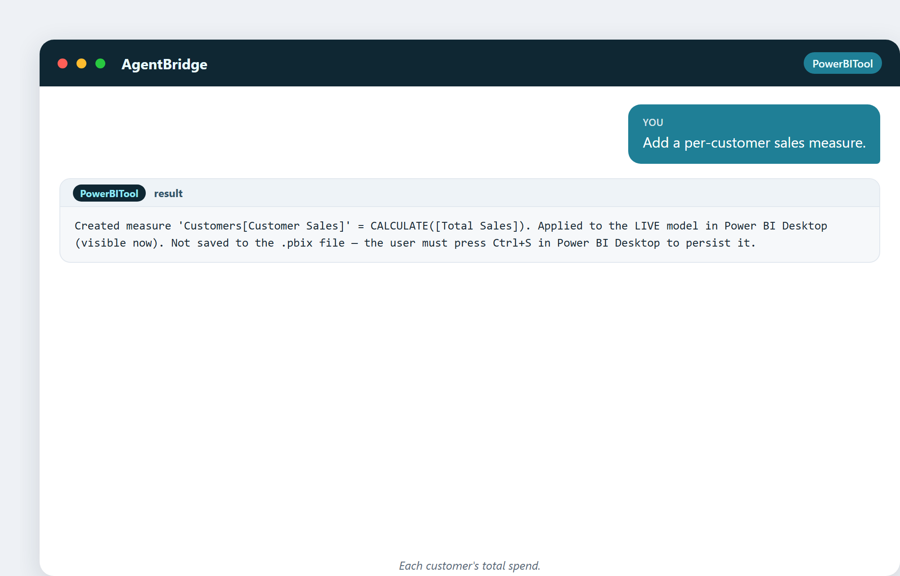
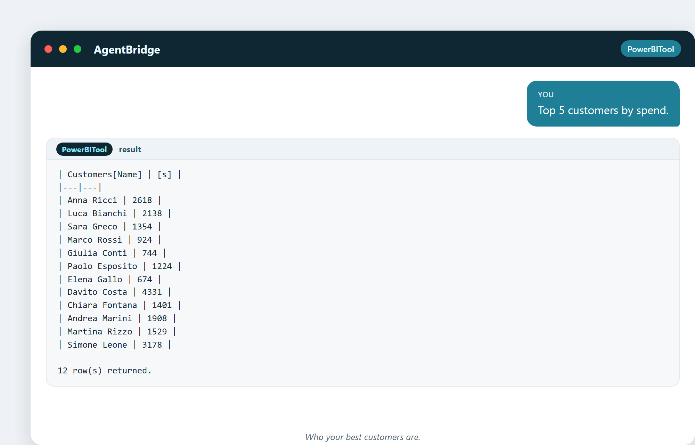
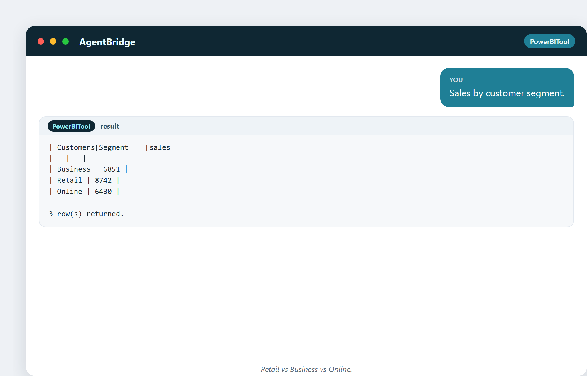
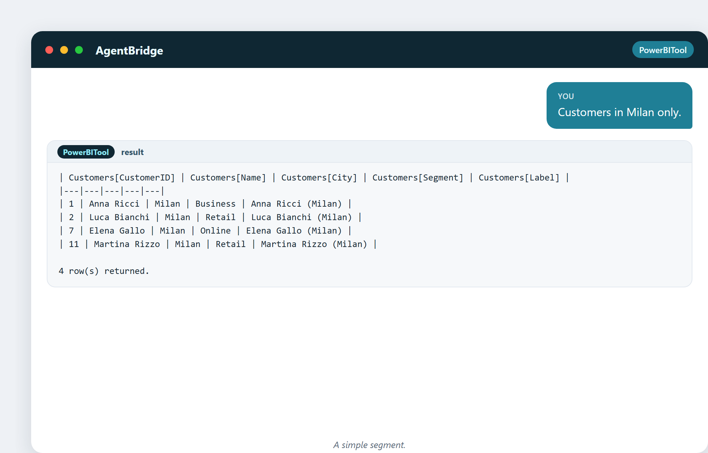

# 13. Connaître ses clients

Si vous ne devez analyser qu'une chose dans votre entreprise, analysez les clients.
C'est de là que vient l'argent, et c'est là qu'il s'enfuit. Un peu d'analyse sur qui
achète, combien, et qui s'en va, vaut mieux que mille graphiques sur les produits.

## Les questions sur les clients

Toute entreprise veut secrètement savoir :

- Qui sont mes meilleurs clients ?
- Quels clients sont sur le point de partir ?
- Lesquels valent la peine d'être reconquis ?
- Combien dépense chaque type de client ?
- D'où viennent mes clients ?

Répondez à cela et vous pouvez concentrer votre argent et vos efforts là où ils
rapportent.

## Une mesure par client : le socle

Pour analyser les clients, il vous faut une mesure qui agrège la dépense de chaque
client :

> « Ajoute une mesure de ventes par client. »

Maintenant chaque client a un chiffre « Ventes client », et vous pouvez les classer,
les segmenter et les comparer toute la journée.

## Qui sont les meilleurs clients ?

> « Top 5 des clients par dépense. »

Instantanément, vous voyez qui compte. Dans ces données, quelques clients portent
une large part du chiffre d'affaires — ce qui est normal et important. Ça veut dire :
**occupez-vous de ces gens.** Perdre l'un d'eux fait mal.

Le même classement, dessiné en graphique :

## Segmenter : découper les clients en groupes

Un **segment** est un groupe de clients qui se comportent de façon semblable. Vous
pouvez découper par n'importe quoi :

> « Ventes réparties par ville du client. »

Les totaux par ville, en graphique :

> « Ventes par segment de client. »

Par ville, par segment (Détail / Professionnel / En ligne), par montant dépensé —
chaque tranche révèle une opportunité différente. Peut-être que le segment
Professionnel dépense plus par tête et mérite une offre spéciale. Peut-être qu'une
ville est mal desservie et pourrait croître.

La répartition par segment, en anneau :

## Un vrai cadre : la méthode RFM

La méthode d'analyse client la plus célèbre est la **RFM** — trois lettres :

- **Récence** — depuis combien de temps ont-ils acheté ?
- **Fréquence** — à quelle fréquence achètent-ils ?
- **Montant** — combien dépensent-ils ?

Notez chaque client sur ces trois critères et vous pouvez les trier en groupes : les
champions fidèles, les acheteurs occasionnels, ceux qui dérivent. La RFM est
puissante parce qu'elle est simple et qu'elle fonctionne : les clients qui ont
acheté récemment, souvent et beaucoup sont votre or ; les clients qui n'ont pas
acheté depuis un moment sont ceux à reconquérir avant qu'ils ne soient partis.

## Trouver les clients à haute valeur

> « Crée une mesure de client à haute valeur. »

Un drapeau qui marque les clients au-dessus d'un seuil de dépense — ceux à
protéger, à récompenser, et à ne jamais perdre.

## Encore quelques coupes

> « Clients de Milan uniquement. »

> « Dépense moyenne par client professionnel. »

Chacune une question toute simple, chacune une vraie réponse du modèle en direct.

## Une curiosité : l'attrition qu'on ne voit pas

Les clients les plus coûteux à perdre sont ceux qui s'en vont **en silence** — ils ne
se plaignent jamais, ils cessent simplement d'acheter. Quand vous vous en apercevez,
ils sont partis et vous n'avez jamais su pourquoi. Un simple rapport « clients n'ayant
pas acheté depuis 90 jours » les attrape tôt, tant qu'on peut encore les reconquérir.
L'attrition silencieuse est la fuite que vous ne pouvez pas vous permettre de
manquer.

---

## Ce que vous garderez de ce chapitre

- Les clients sont ce qu'il y a de plus précieux à analyser.
- Une mesure par client débloque le classement et la segmentation.
- La RFM (Récence, Fréquence, Montant) est la méthode classique, qui marche partout.
- Segmentez par n'importe quoi : ville, type, dépense.
- Guettez l'attrition silencieuse — les clients qui partent sans se plaindre.

Suite : le temps — la dimension qui transforme un instantané en une histoire de
changement.
