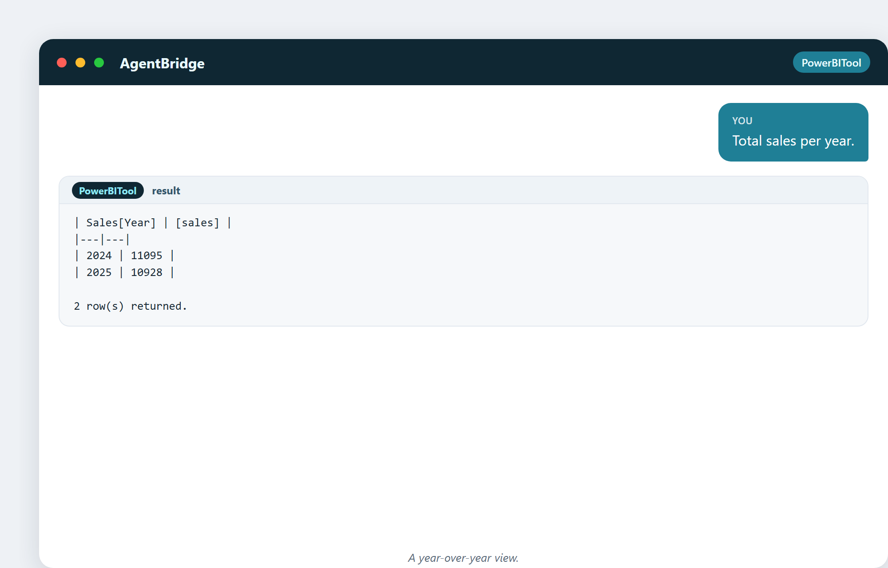
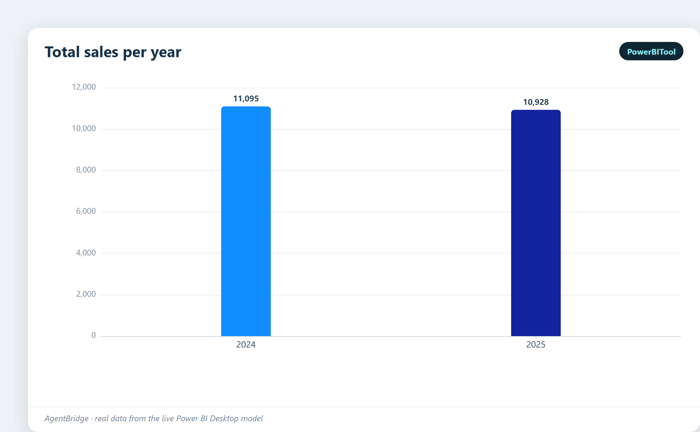
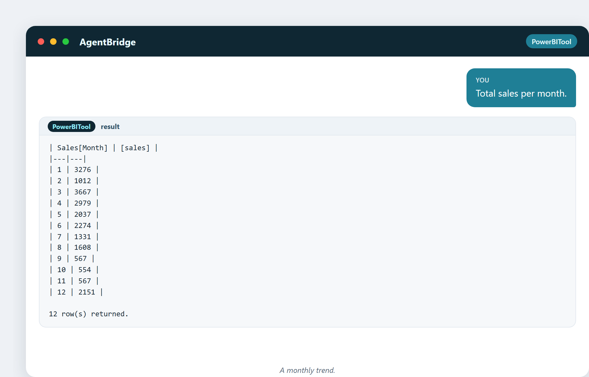
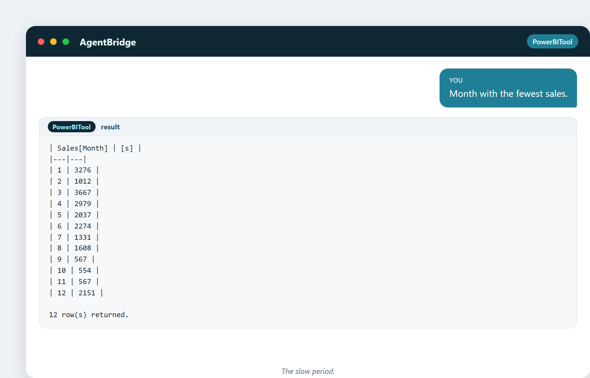

# 14. Tendances, temps et saisonnalité

Un nombre est un instantané. Ajoutez le temps, et il devient une histoire. Des
ventes de 11 000 € ne veulent pas dire grand-chose tant que vous ne savez pas si
c'est en hausse ou en baisse, et si c'est normal pour cette période de l'année. Le
temps est la dimension qui transforme une photo en film, et presque toute question
commerciale importante vit dedans.

## Pourquoi le temps est spécial

Le temps est la seule dimension que vous ne pouvez pas éviter. Chaque vente, chaque
clic, chaque enregistrement se produit *à* un instant. Et le temps a une propriété
que les autres dimensions n'ont pas : **les choses se répètent.** La glace se vend
en été. Le commerce de détail fait un pic à Noël. Les logiciels de fiscalité
rugissent en avril. Cette répétition, c'est la **saisonnalité**, et la repérer vous
empêche de paniquer devant un « creux » qui revient chaque janvier sans exception.

## Découper la date en morceaux exploitables

Les dates brutes sont ingrates. Pour analyser le temps, on découpe la date en
morceaux — année, mois, jour — en colonnes sur lesquelles on peut regrouper :

> « Ajoute une colonne Année à partir de la date. »

> « Ajoute une colonne Mois à partir de la date. »

Maintenant vous pouvez regrouper par année ou par mois et voir la forme du temps.

## La vue d'une année sur l'autre

> « Total des ventes par année. »

Deux années, côte à côte. 2025 est-elle meilleure que 2024 ? La comparaison est
tout l'intérêt — une seule année ne vous dit rien, mais deux années vous donnent la
direction.

La comparaison d'une année sur l'autre, en graphique :

## La tendance mensuelle

> « Total des ventes par mois. »

Douze mois de données. Vous voyez les pics et les creux — les mois chargés et les
mois calmes. C'est la forme brute du battement de cœur de votre entreprise.

Le battement mensuel, dessiné en courbe :

## Filtrer une période

> « Ventes de 2025 uniquement. »

> « Ventes du premier semestre d'une année. »

Découper une fenêtre de temps précise, c'est ainsi qu'on répond à « comment avons-
nous fait le trimestre dernier ? » en une phrase.

## Trouver la période creuse

> « Le mois avec le moins de ventes. »

Connaître votre mois le plus lent est aussi utile que connaître le plus chargé —
c'est là que vous planifiez les promotions, programmez la maintenance, ou vous
préparez à une accalmie.

## Les moyennes mobiles : lisser le bruit

Les chiffres mensuels sont bosselés. Une **moyenne mobile** (par exemple, la moyenne
des 3 derniers mois) lisse les bosses pour que la tendance de fond apparaisse. C'est
la différence entre regarder une caméra à l'épaule tremblante et un plan fluide à
la steadicam. La tendance est ce que vous voulez voir ; la moyenne mobile la révèle.

## Une curiosité : « l'effet janvier » qui n'existe pas

Un manager voit les ventes de janvier en baisse de 30 % et convoque une réunion
d'urgence. Mais janvier est *toujours* en baisse après la frénésie des fêtes de
décembre. Sans comparaison avec le janvier dernier, la baisse n'a aucun sens — c'est
la saison, pas un problème. C'est pourquoi les analystes comparent **d'une année sur
l'autre** (ce janvier-ci contre le janvier dernier) plutôt que **de mois en mois**
(janvier contre décembre). La bonne comparaison transforme une fausse alerte en non-
événement.

---

## Ce que vous garderez de ce chapitre

- Le temps transforme un instantané en une histoire.
- Découpez les dates en année/mois/jour pour regrouper et voir les tendances.
- La saisonnalité veut dire que les choses se répètent — ne paniquez pas devant le creux attendu.
- Comparez d'une année sur l'autre, pas seulement de mois en mois.
- Les moyennes mobiles lissent le bruit pour révéler la tendance.

Suite : comment savoir si une différence est réelle et pas juste de la chance ? Une
douce visite des tests et du hasard.
