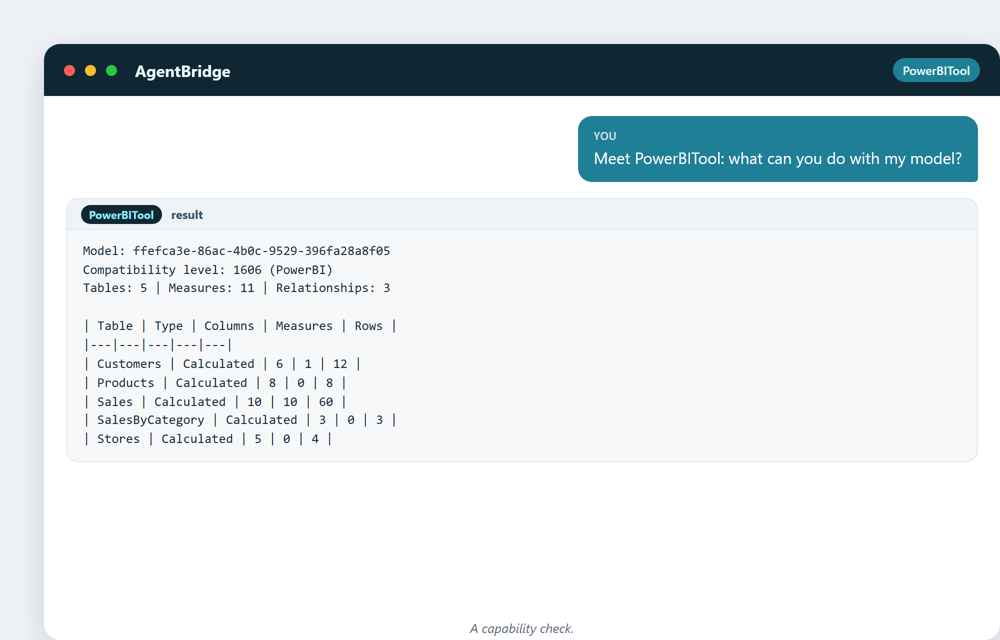

# 23. Découvrir AgentBridge et PowerBITool

Chaque exemple de ce livre a été réalisé avec deux outils travaillant ensemble. Ce chapitre les présente comme il faut — ce qu'est chacun, comment ils s'articulent, et ce qu'ils peuvent faire.

## AgentBridge : l'assistant

**AgentBridge** est un assistant IA qui tourne sur votre propre ordinateur. Vous lui parlez avec des mots simples, et il accomplit du travail à travers vos outils. Ce n'est pas un chatbot qui ne fait que parler — il agit. Il peut rédiger des documents, créer des tableurs, envoyer des e-mails, faire des recherches sur le web et, avec le bon plugin, piloter Power BI.

Les propriétés clés :

- **Local.** Il tourne sur votre machine. Vos données restent chez vous.
- **En langage courant.** Vous décrivez ce que vous voulez ; vous n'écrivez pas de code.
- **Extensible.** Des plugins lui donnent de nouvelles capacités. PowerBITool en fait partie.

## PowerBITool : les mains dans Power BI

**PowerBITool** est le plugin qui donne à AgentBridge des mains dans Microsoft Power BI Desktop. Grâce à lui, l'assistant peut :

- **Se connecter** au modèle en direct d'un rapport ouvert.
- **Inspecter** — synthèse du modèle, tables, schéma, mesures, relations.
- **Éditer le modèle** — créer et supprimer des tables, des colonnes, des mesures, des relations ; définir des descriptions.
- **Exécuter et valider du DAX** — avec un garde de sécurité qui bloque tout ce qui est dangereux.
- **Profiler et documenter** — profiler les tables, générer un dictionnaire de données, vérifier les bonnes pratiques.

Voici l'assistant qui se présente à un modèle :

> « Découvre PowerBITool : que peux-tu faire avec mon modèle ? »



La synthèse qu'il renvoie, c'est toute la surface : tables, mesures, relations, nombre de lignes — tout ce qu'il peut voir et manipuler.

## Comment ils s'articulent

```
You  →  AgentBridge (the brain)  →  PowerBITool (the hands)  →  Power BI Desktop (the model)
```

AgentBridge comprend vos mots et planifie l'action. PowerBITool exécute cette action sur le modèle Power BI en direct. Vous voyez le résultat immédiatement dans Power BI Desktop. La boucle est : demander → réfléchir → agir → voir.

## Le garde de sécurité

Une chose mérite d'être soulignée : PowerBITool fait passer le DAX par un **garde à faille fermée**. Il autorise les requêtes en lecture seule (`EVALUATE`, vues système) et bloque tout ce qui pourrait modifier le modèle par la porte de la requête — pas de `DROP`, pas d'`INSERT`, pas de `DELETE`, pas de combines multi-instructions. Si une requête n'est pas clairement sûre, elle est rejetée. C'est ce qui rend responsable de laisser une IA toucher un modèle en direct.

## Gratuit, et soutenu par de vraies personnes

Les deux outils sont gratuits. PowerBITool est ouvert sur GitHub, et — comme la préface l'avait promis — le support est gratuit lui aussi : ouvrez une issue et un vrai technicien répond sous environ 24 heures avec un vrai correctif. Cette combinaison (outil gratuit, support humain gratuit, réponses rapides) est la promesse derrière chaque exemple que vous avez vu.

## Une curiosité : le modèle de plugin

PowerBITool n'est pas compilé dans AgentBridge. C'est un **plugin** déposé dans un dossier `Tools`, découvert au démarrage. Cela signifie que les capacités de l'assistant peuvent grandir sans toucher au cœur — aujourd'hui Power BI, demain d'autres outils. Le modèle de plugin explique pourquoi l'assistant peut continuer à gagner de nouvelles « mains » sans enfler.

## Ce qu'on peut faire avec eux, ensemble

Tout ce qu'il y a dans ce livre, et plus encore : se connecter à un rapport, comprendre le modèle, nettoyer des données avec des colonnes calculées, construire des mesures, câbler des relations, valider et vérifier du DAX, générer de la documentation, et contrôler les bonnes pratiques — le tout en parlant.

---

## Ce que vous garderez de ce chapitre

- AgentBridge est l'assistant local, en langage courant (le cerveau).
- PowerBITool est le plugin qui pilote Power BI Desktop (les mains).
- La boucle : demander → réfléchir → agir → voir, le tout en local.
- Un garde à faille fermée protège le modèle en direct.
- Outil gratuit, support gratuit, de vrais humains, des réponses rapides.

Suite : une journée entière du travail de l'analyste, automatisée.
