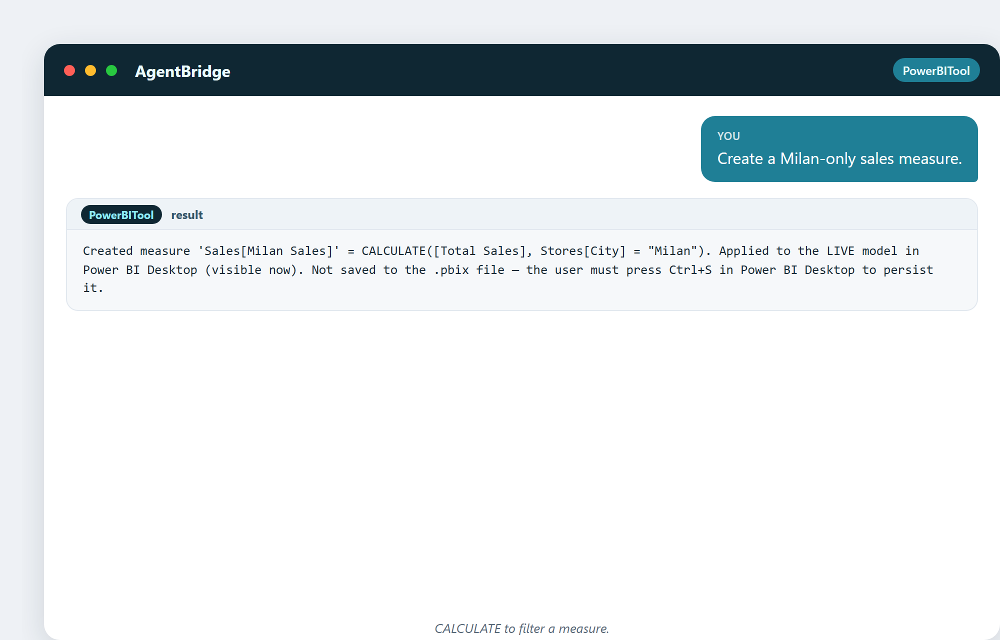
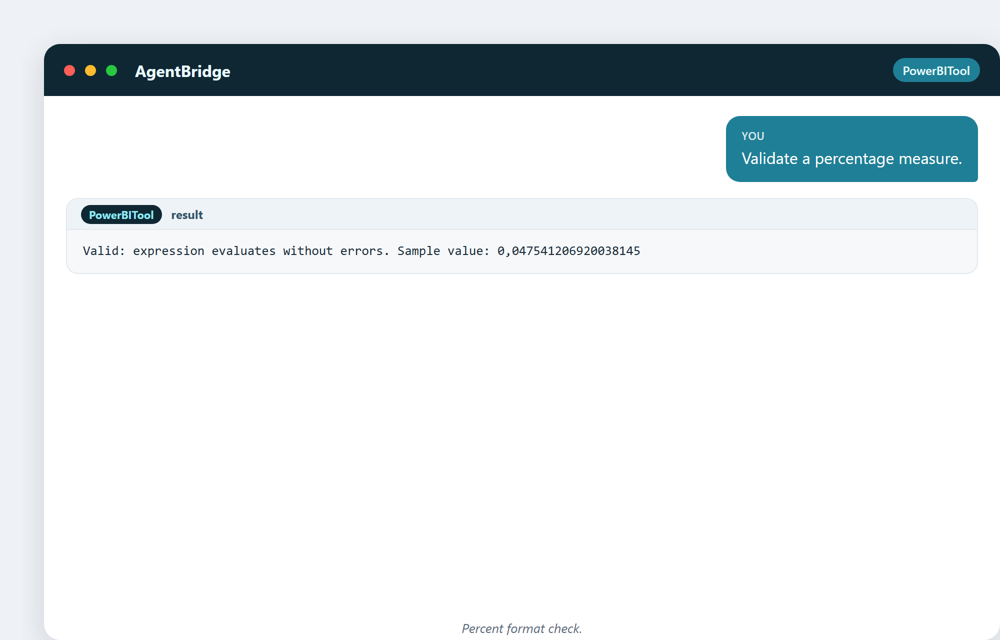
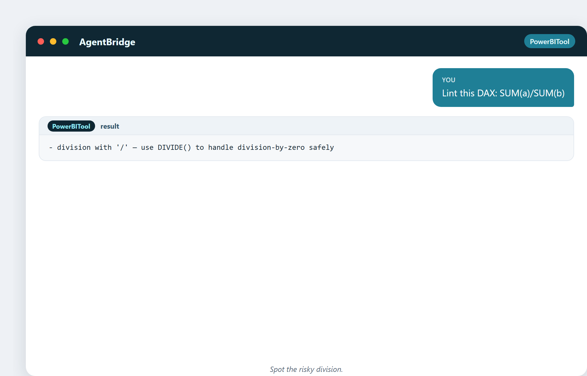
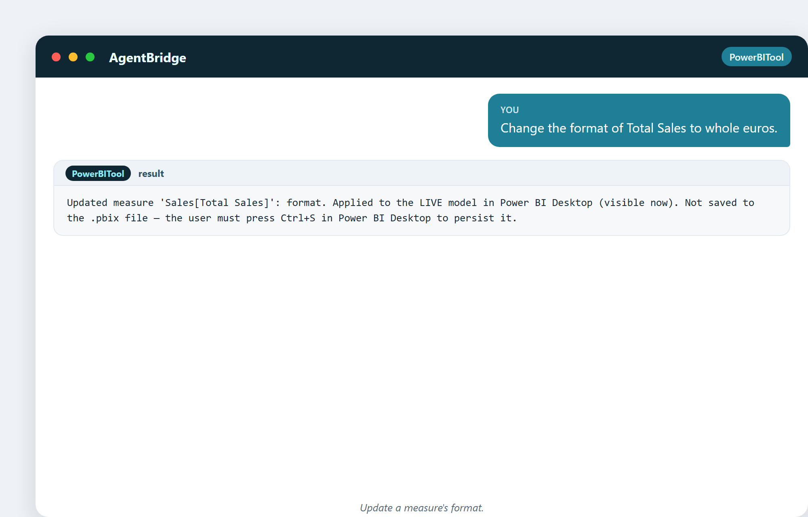
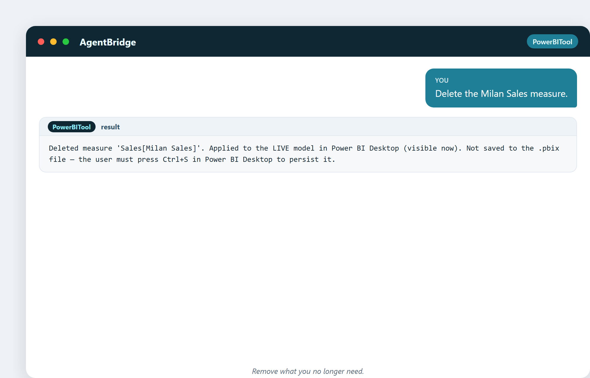

# DAX: il linguaggio dietro i numeri

DAX è il linguaggio di calcolo dentro Power BI. Ha la nomea di fare paura. Questo
capitolo parla di perché conta, e perché, con l'assistente, puoi usarlo senza mai
combatterlo.

## A cosa serve DAX

DAX (Data Analysis Expressions) calcola i numeri nei tuoi report: totali, medie,
percentuali, anno su anno, totali progressivi, classifiche. Ogni misura che vedi su
una dashboard Power BI è DAX sotto il cofano.

Le funzioni centrali sono semplici: `SUM`, `AVERAGE`, `COUNT`, `MIN`, `MAX`, e la
potentissima `CALCULATE`, che ti permette di calcolare un numero *sotto un filtro
specifico*.

## L'assistente lo scrive; tu lo leggi

Non digiti DAX. Descrivi il numero che vuoi, e l'assistente scrive il DAX e crea
la misura dal vivo. Ma dovresti essere in grado di *leggere* ciò che ha prodotto,
così da fidartene.

> "Crea una misura vendite solo Milano."

Sotto il cofano è `CALCULATE([Total Sales], Stores[City] = "Milan")`: le vendite
totali, ma solo dove la città è Milano. Una volta visto il pattern, DAX smette di
essere magia.

## Valida prima di fidarti

L'assistente può testare una formula senza creare nulla:

> "È una misura valida? SUM(Sales[Amount])"

> "Controlla questa formula rotta: SUMX(Sales[Amount])"

Una passa, una fallisce, e impari cosa c'è che non va *prima* che diventi una misura
rotta nel modello. Questa abitudine del "controlla prima" fa risparmiare ore di
debugging.

> "Valida una misura CALCULATE."

> "Valida una misura percentuale."

## Linting: il vigile dello stile per DAX

Oltre a "funziona?", l'assistente può controllare "è *ben scritta*?", un processo
chiamato **linting**. Fiuta errori comuni e pattern rischiosi.

> "Fai il lint di questo DAX: SUM(a)/SUM(b)"

Avverte: non usare una `/` semplice, usa `DIVIDE`, che gestisce la divisione per
zero in sicurezza. Un piccolo promemoria che previene un'intera classe di errori
`#DIV/0!`.

> "Fai il lint di questo DAX pulito con DIVIDE."

La versione pulita passa. Impari il buon pattern vedendolo premiato.

> "Fai il lint di una misura che usa IFERROR."

Segnala `IFERROR` come un cattivo segno: incartare gli errori può nascondere veri
bug invece di sistemarli. Il linter insegna buone abitudini un avvertimento alla
volta.

## Modificare le misure

Le misure evolvono. L'assistente può aggiornarle e cancellarle:

> "Cambia il formato di Vendite Totali in euro interi."

> "Cancella la misura Milan Sales."

Rinomina, riformatta, rimuovi: tutto dal vivo, tutto reversibile finché non
salvi.

## Una curiosità: la bestia del contesto di filtro

La ragione per cui DAX è chiamato difficile è un concetto: il **contesto di
filtro**: l'insieme invisibile di filtri che un calcolo vede in ogni momento (la
riga corrente, la selezione corrente dello slicer, il visual corrente).
Padroneggialo e DAX è tuo amico; fraintendilo e i numeri sembrano sbagliati in modi
difficili da rintracciare. Ecco la verità liberatoria di questo libro: **tu
descrivi la risposta, e l'assistente gestisce il contesto di filtro.** La bestia
diventa un problema dello strumento, non tuo.

---

## Cosa ti porti a casa da questo capitolo

- DAX calcola i numeri; `CALCULATE` è la sua parola più potente.
- Tu descrivi la risposta; l'assistente scrive il DAX.
- Valida una formula prima di crearla.
- Fai il lint per cogliere i pattern cattivi (`/` semplice, `IFERROR` che
  nasconde bug).
- La parte difficile, il contesto di filtro, ora è un compito dello strumento.

Prossimo: vedere è credere: come scegliere il grafico giusto e non mentire con le
visual.
