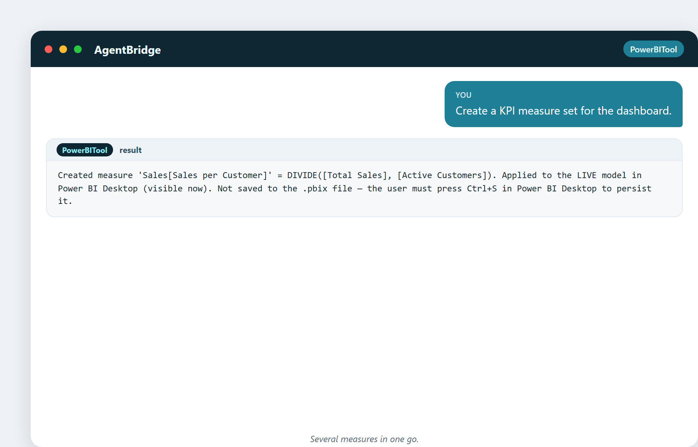
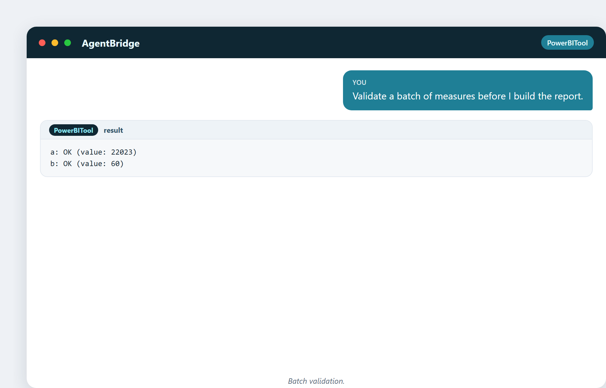
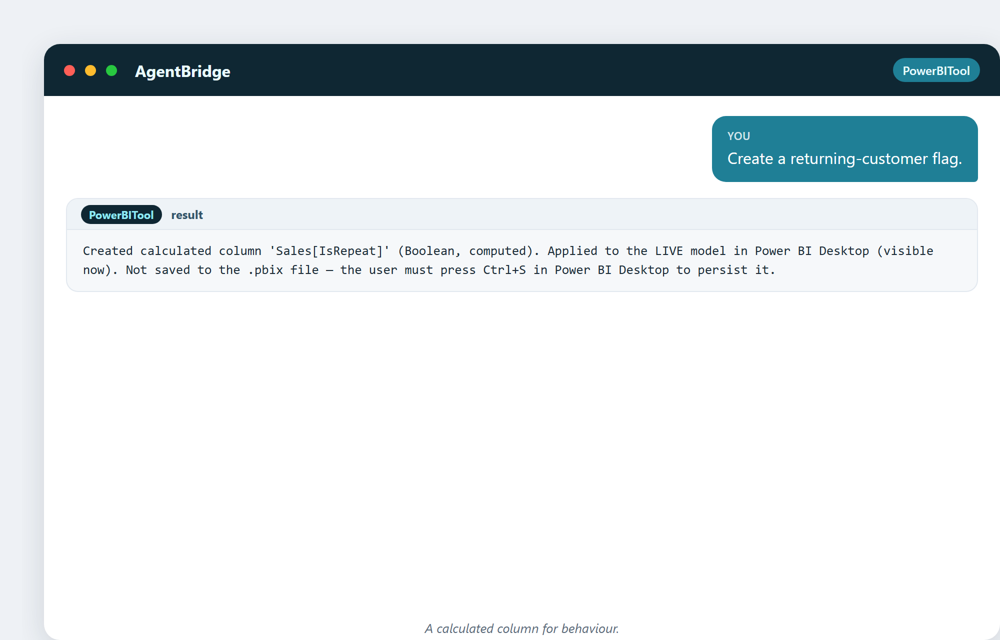
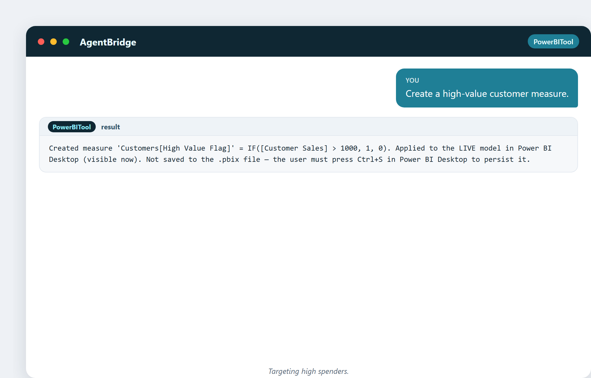
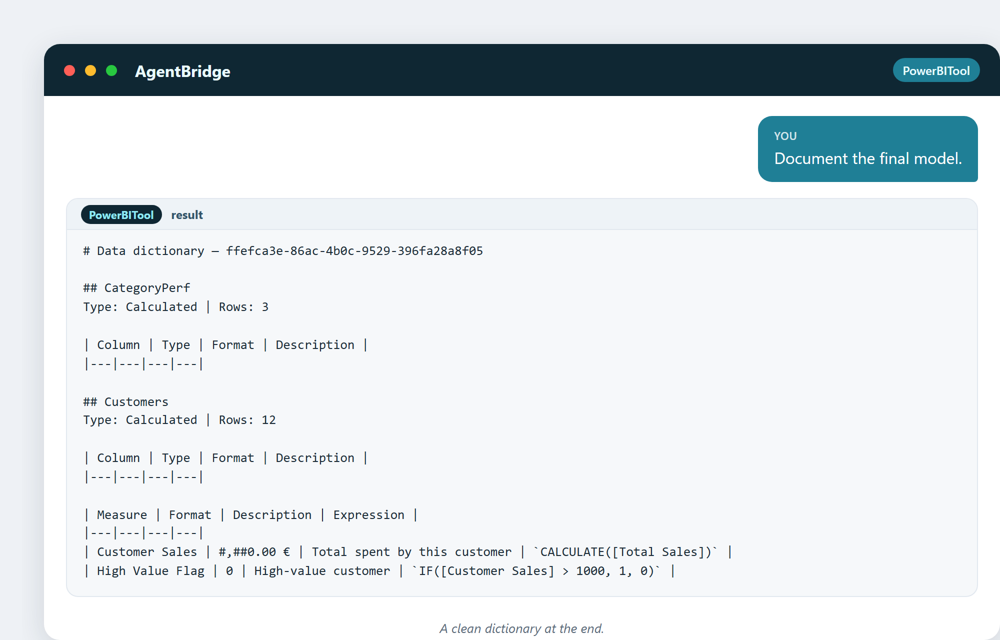
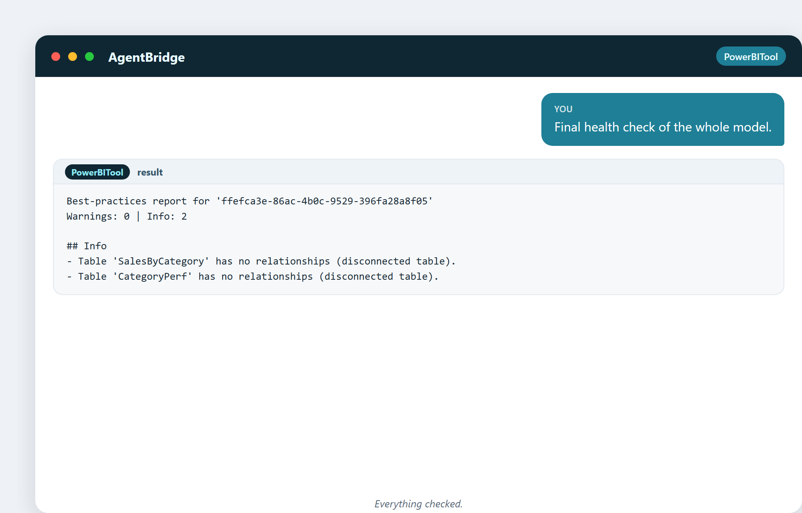

# Automatizzare la giornata dell'analista

Passiamo una giornata dentro il lavoro dell'analista e guardiamo l'assistente
gestirlo. Questo capitolo cuce insieme gli esempi come va una vera giornata di
lavoro: costruisci, valida, documenta, controlla, finisci. Ogni immagine è una vera
azione su un modello vivo.

## Mattina: costruisci i pezzi del report

La giornata comincia trasformando le tabelle grezze in pezzi di report. Invece di
cliccare per un'ora, chiedi ciò di cui la dashboard ha bisogno.

> "Costruisci una tabella di performance per categoria con vendite e conteggio
> prodotti."

Una richiesta, una nuova tabella: vendite e conteggio prodotti per categoria,
calcolati e vivi.

Poi i KPI di cui la dashboard ha bisogno:

> "Crea un set di misure KPI per la dashboard."

Una misura per fatturato per cliente, creata e applicata. Il tipo di piccola
metrica che una volta prendeva un minuto attento ciascuno ora arriva in una
frase.

## Prima della riunione: valida tutto

Prima di costruire il report, controlli che i numeri siano giusti. L'assistente
valida un intero gruppo in una volta:

> "Valida un gruppo di misure prima che costruisca il report."

Ogni misura restituisce OK con il suo valore. Niente sorprese davanti al
capo.

## A mezza mattina: cogli le lacune

Un buon analista cerca ciò che *manca*, non solo ciò che è presente:

> "Quali prodotti non hanno mai venduto?"

La query gira e restituisce zero righe: ogni prodotto ha venduto almeno una volta.
Anche questa è una risposta utile: niente magazzino morto nascosto nel
catalogo.

## Tarda mattina: comportamento del modello

Vuoi segnalare un comportamento ripetuto senza etichettare righe a mano:

> "Crea un flag cliente abituale."

Una colonna booleana che contrassegna ogni vendita come ripetuta o no: calcolata su
tutta la tabella in un colpo.

E il migliore:

> "Dammi il negozio migliore per vendite."

Milano Centrale guida. La classifica che una volta serviva una pivot e un ordinamento
ora è una singola domanda.

## Pomeriggio: mirare

Il team marketing vuole clienti ad alto valore:

> "Crea una misura cliente ad alto valore."

Un flag per i clienti sopra una soglia di spesa, vivo nel modello, pronto su cui
filtrare.

E per vedere come performano le fasce di prezzo che abbiamo creato prima:

> "Vendite per fascia di prezzo."

Alto, Medio, Basso: la colonna fascia del Capitolo 7 ora guida una vera
scomposizione. Questo è il frutto di costruire piccoli pezzi: dopo si combinano.

## Fine giornata: documenta e controlla

Prima di chiudere, documenti il lavoro e ne controlli la salute. L'assistente
scrive il dizionario per tutto il modello:

> "Documenta il modello finale."

Ogni tabella, ogni misura, con il suo formato ed espressione: documentazione che non
avresti mai scritto a mano, fatta per te.

Poi il check-up:

> "Check-up finale di tutto il modello."

Zero avvertimenti. Le due note "info" sono solo tabelle riassuntive disconnesse, il
che è atteso. Il modello è pulito.

## Chiusura: il modello finito

A fine giornata, guardi cosa hai costruito:

> "Mostra l'elenco finale delle tabelle."

Sei tabelle, quattordici misure, tre relazioni: un modello analitico funzionante,
costruito e documentato in una singola giornata di richieste in linguaggio
semplice.

## Cosa mostra la giornata

Un'intera giornata di lavoro: costruisci, valida, cogli lacune, modella
comportamento, mira, documenta, controlla: fatto descrivendo ogni passo. Le mani
dell'analista non hanno fatto nemmeno un clic. La testa dell'analista ha preso tutte
le decisioni.

Questo è lo scambio che questo libro continua a fare: **tu tieni il giudizio, lo
strumento prende la fatica.**

---

## Cosa ti porti a casa da questo capitolo

- Un'intera giornata di lavoro dell'analista corrisponde a una sequenza di richieste
  in linguaggio semplice.
- Costruisci pezzi (tabelle, misure), validali, cogli lacune, documenta,
  controlla.
- I piccoli pezzi si combinano dopo (la fascia di prezzo guida una
  scomposizione).
- Il modello finisce pulito, documentato e pronto, senza nessuno dei clic
  manuali.

Prossimo: storytelling, etica e governance: la parte che lo strumento non può fare
per te.
