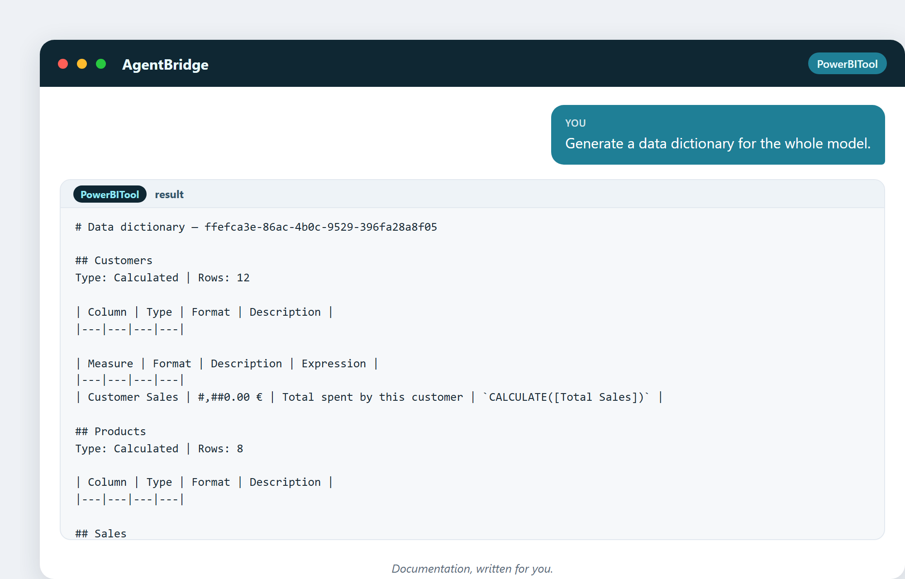
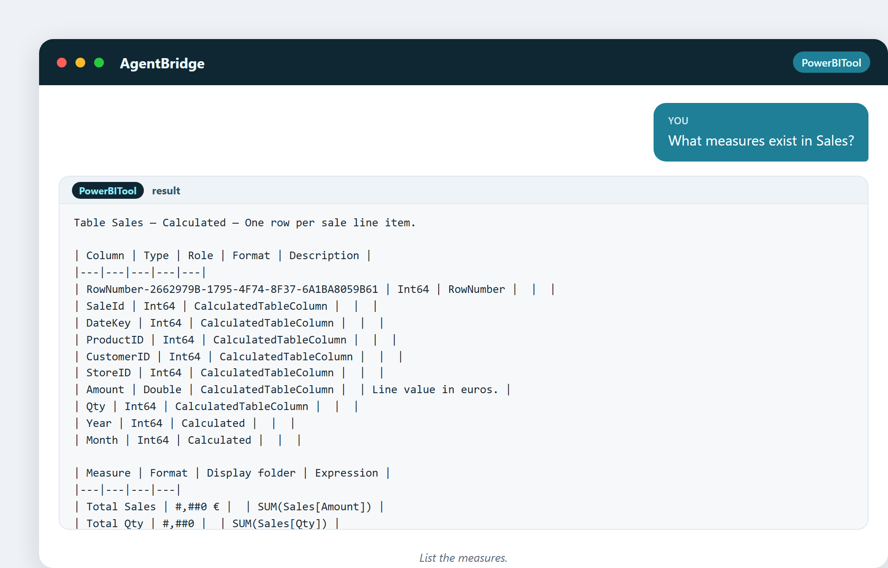

# 16. Power BI простым языком

Вы слышали это название. Эта глава разделывает Power BI до того, чем оно является на
самом деле, без маркетингового тумана, — и показывает, как ассистент говорит с ним
напрямую.

## Что Power BI есть на самом деле

Power BI — это инструмент Microsoft для превращения данных в **дашборды и
отчёты**, на которые люди могут смотреть, кликать по ним и исследовать их. У него
три главные части:

- **Power BI Desktop** — бесплатная программа на вашем ПК, где вы строите модель и
  отчёт. Именно здесь работает ассистент.
- **Power BI Service** — онлайн-место, куда вы публикуете дашборды, чтобы другие
  видели их в браузере или на телефоне.
- **Power BI Mobile** — приложение, чтобы проверять дашборды на ходу.

Строите вы в Desktop. Делитесь через Service. Вот и вся картина.

## Три слоя внутри

У каждого проекта Power BI три слоя, и полезно знать их названия:

1. **Данные** — к чему вы подключаетесь (база данных, файл, веб-источник).
2. **Модель** — таблицы, связи и меры, которые вы строите поверх данных.
3. **Отчёт** — визуальные страницы, на которые люди реально смотрят.

Ассистент работает почти целиком в слое **модели** — таблицы, меры, связи. Слой
отчёта (красивые визуалы) — место, где человек раскладывает вещи на холсте.
Модель — двигатель; отчёт — приборная панель.

## Увидеть модель вживую

Ассистент может прочитать всю модель и доложить:

> «Дай мне сводку по модели.»

Таблицы, меры, связи, число строк — весь двигатель в одном виде. Это первое, что
вы делаете, открыв любой проект Power BI: понять модель.

> «Перечисли каждую таблицу с числом строк.»

Строительные блоки, посчитанные и готовые.

## Словарь данных: документация бесплатно

Один из самых полезных трюков ассистента — писать **словарь данных**: документ,
перечисляющий каждую таблицу, каждый столбец и каждую меру с тем, что они значат.

> «Сгенерируй словарь данных для всей модели.»

Документация, у которой аналитик ушёл бы на полдня, появляется за секунду. Это
много значит: хорошая документация — это разница между моделью, которой команда
может доверять, и моделью, которую понимает один человек.

## Увидеть меры

> «Какие меры есть в Sales?»

Каждая мера с её формулой и форматом. Когда кто-то спрашивает «как считается
Total Sales?», ответ прямо там.

## Любопытный факт: невероятный взлёт Power BI

Power BI начался в 2015-м как маленькая надстройка и вылетел на вершину мира
аналитики, во многом потому, что Microsoft привязала его к инструментам, что у
компаний уже были, и оценила достаточно низко, чтобы почти любой мог попробовать.
Его тихая суперсила в том, что он сидит внутри экосистемы Microsoft — Excel,
Azure, Office, — так что для миллионов бизнесов он был путём наименьшего
сопротивления. Лучший инструмент — часто не лучший инструмент; это тот, что уже
есть.

## Почему ассистент здесь важен

Power BI могуществен, но у него есть кривая обучения — DAX, представление модели,
лента кнопок. Ассистент убирает эту кривую для работы с моделью: вы описываете,
что хотите, он правит модель вживую. Визуалы вы всё равно раскладываете сами, но
трудная часть — меры и проводка — становится разговором.

---

## Что вы унесёте из этой главы

- Power BI = Desktop (строить), Service (делиться), Mobile (смотреть).
- Три слоя: данные, модель, отчёт.
- Ассистент работает в слое модели.
- Он может по запросу резюмировать, перечислять и документировать модель.
- Ассистент убирает кривую обучения для трудной части.

Дальше: как ассистент находит ваш Power BI Desktop и подключается к нему — момент,
когда двое встречаются.
