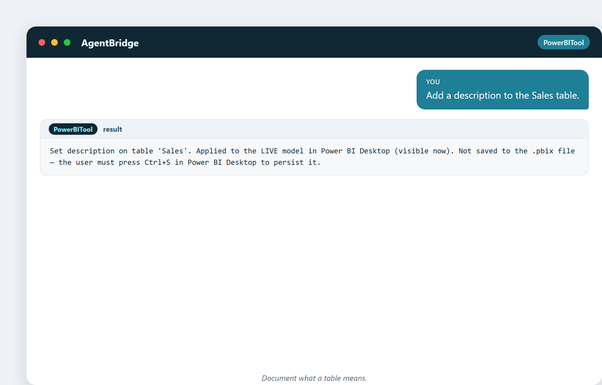
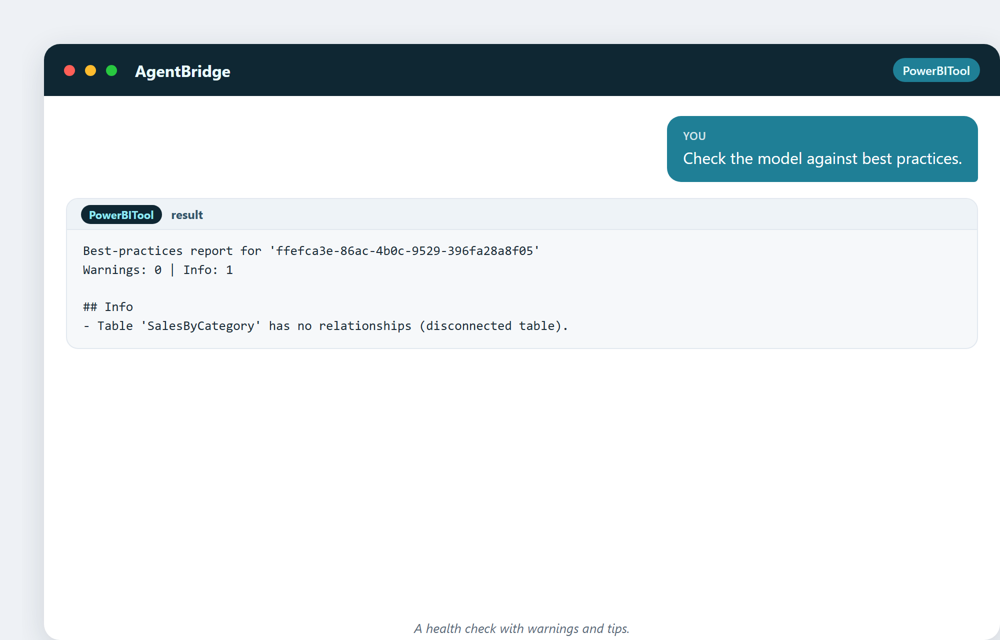

# 18. Моделирование данных в Power BI

Моделирование — место, где анализ выигрывается или проигрывается. Хорошая модель
делает каждый вопрос лёгким; плохая модель делает каждый вопрос дракой. Эта глава
показывает ассистента как аккуратного модельера — такого, что не только строит
модель, но и документирует её и сверяет с лучшими практиками.

## Как выглядит хорошая модель

Вы встретили звёздную схему в главе 8. В Power BI хорошая модель значит:

- Чистая **факт-таблица** (числа: продажи, транзакции).
- Аккуратные **таблицы измерений** (описания: товары, клиенты, даты).
- **Связи** разведены правильно (многие-к-одному, без двусмысленности).
- **Меры** с ясными именами, форматами и описаниями.
- **Документация**, чтобы следующий человек (или вы через полгода) её понял.

Ассистент помогает со всем этим вживую.

## Документировать по ходу

Хорошие модели — задокументированные модели. Ассистент может добавлять описания к
таблицам и столбцам по запросу:

> «Добавь описание к таблице Sales.»

> «Опиши столбец Amount.»

Эти маленькие заметки показываются в модели и в словаре данных. Это разница между
моделью, что чёрный ящик, и моделью, что общий актив.

> «Поставь описание на таблицу Products.»

## Словарь данных, таблица за таблицей

Можно задокументировать всю модель или одну таблицу:

> «Сгенерируй словарь данных только для Products.»

Сфокусированный словарь для одной таблицы — удобно, когда передаёте кусок модели
коллеге.

## Медосмотр: лучшие практики

Это один из самых ценных ходов ассистента. Он сканирует всю модель и докладывает
проблемы и советы:

> «Проверь модель по лучшим практикам.»

Он флагует меры без строки формата, таблицы без описания, отключённые таблицы —
маленькие грешки, что делают модель трудной в использовании. Это как линтер для
вашей модели данных: работать не помешает, но скажет, где модель неряшлива, до
того как неряшливость укусит.

## Перепроверка после изменений

По мере стройки модель дрейфует. Повторный запуск проверки держит её честной:

> «Лучшие практики после добавления мер.»

Быстрое сканирование показывает, что внесли ваши последние изменения. Строй,
проверяй, чини, повторяй — ритм чистой модели.

## Любопытный факт: коэффициент автобуса

В софтверных командах есть метрика под названием **коэффициент автобуса**: сколько
людей должны быть «сбиты автобусом», прежде чем проект встанет, потому что только
один человек его понимает. Модель без документации имеет коэффициент автобуса
один — это страшно. Каждое описание и каждая запись словаря, что пишет ассистент,
поднимают это число. Вы не просто прибираетесь; вы делаете модель жизнестойкой.

## Почему ассистент — хороший модельер

Человек-модельер под давлением дедлайна пропускает документацию и лучшие
практики. Ассистент не устаёт, не пропускает шаги и проверяет всё. Соедините
человеческое суждение о том, *что* моделировать, с прилежанием ассистента в
*документировании и проверке* — и получите модели, что остаются чистыми.

---

## Что вы унесёте из этой главы

- Хорошая модель: чистый факт + измерения, разведено верно, задокументировано.
- Добавляйте описания к таблицам, столбцам и мерам по ходу.
- Генерируйте словари данных, чтобы задокументировать всю модель или одну таблицу.
- Запускайте проверку лучших практик как линтер — часто.
- Документация поднимает коэффициент автобуса; она делает модель жизнестойкой.

Дальше: DAX, язык за числами, — и как вам не приходится его писать.
