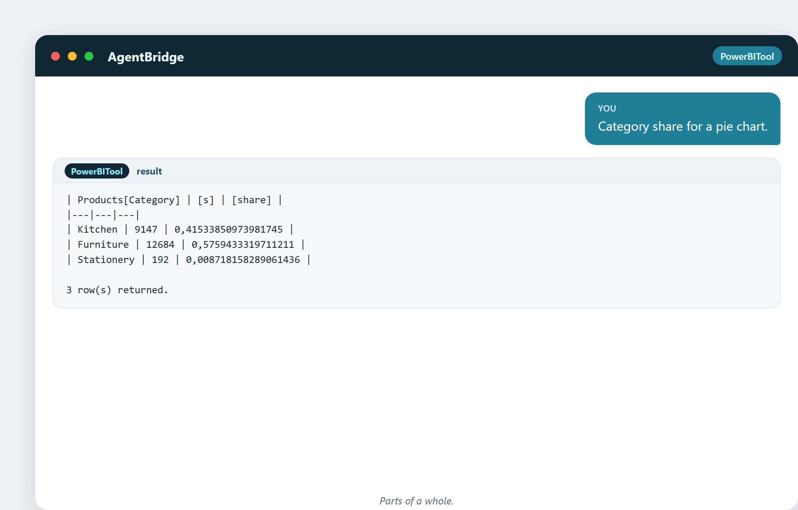

# 20. Как выбрать правильную диаграмму

Диаграмма — не украшение. Это инструмент, делающий правду видимой. Правильная
диаграмма делает инсайт очевидным за секунду; неправильная прячет его или, что
хуже, лжёт. Эта глава о том, чтобы подобрать правильную картинку под правду,
которую вы хотите показать.

## Одно правило

Есть одно правило, покрывающее бо́льшую часть:

> **Подбирай диаграмму под вопрос, а не под то, что круто выглядит.**

Сравниваешь категории? Столбцы. Изменение во времени? Линия. Часть целого?
Круговая (маленькая). Отношение между двумя числами? Точечная. Выберите диаграмму,
что отвечает на вопрос, — и ответ покажет себя сам.

## Сравниваем категории: используйте столбцы

Когда хотите сравнить «сколько на каждую вещь» — продажи по категориям, по
регионам, по товарам — используйте **столбчатую диаграмму** (или гистограмму).
Столбцы глазу легко ранжировать. Ассистент может выдать вам данные, отформованные
ровно под это:

> «Дай мне продажи по категориям для столбчатой диаграммы.»

Три категории, их итоги, готовые стать столбчатой диаграммой. Глаз мгновенно
видит Furniture наверху, Stationery внизу.

И вот те же настоящие данные, отрисованные диаграммой:

> «Продажи по регионам для карты или гистограммы.»

Итоги по регионам, готовые для гистограммы или карты.

## Изменение во времени: используйте линию

Когда вопрос «как это двигалось во времени?», **линейный график** показывает
форму тренда — подъёмы, провалы, сезон — лучше любой таблицы.

Двенадцать месяцев реальных продаж, одна линия. Пик в марте и осеннюю яму видно с
одного взгляда — тот род паттерна, который таблица чисел прячет.

## Часть целого: используйте круговую (осторожно)

Круговая диаграмма показывает, как итог делится на части. Она работает с **тремя
или четырьмя ломтями**. Она плохо проваливается с десятью.

> «Доля категорий для круговой диаграммы.»

Kitchen, Furniture, Stationery как доли целого — чистая круговая. Добавьте дюжину
категорий, и та же диаграмма станет нечитаемым конфетти.

Та же доля, отрисованная кольцом со значениями и процентами:

## Диаграмм, которых стоит избегать

- **3D-диаграммы** — искажают данные. 3D-пирог наклоняет ломти и лжёт об их
  размере. Никогда.
- **Диаграммы с двумя осями** — две оси Y могут заставить несвязанные вещи
  казаться связанными. Используйте с крайней осторожностью или не используйте
  вовсе.
- **Круговые с множеством ломтей** — нечитаемы. Используйте столбчатую.
- **Обрезанные оси** — столбчатая диаграмма, у которой ось начинается с 90%
  вместо 0, делает крошечную разницу огромной. Начинайте ось с нуля, если нет
  веской причины.

## Любопытный факт: диаграмма, обманувшая нацию

На выборах в США 2012 года широко разошедшаяся диаграмма показывала, что президент
Обама побеждает с «98% голосов», — потому что это была карта побед по *округам*,
а сельские округа огромны по площади, но крошечны по населению. Карта показывала
землю, а не людей, и ввела в заблуждение миллионы. Урок: диаграмма может быть
технически точной и совершенно вводящей в заблуждение. Задача аналитика — выбрать
вид, что показывает *правду*, а не просто *какую-то* правду.

## Цвет со смыслом

Цвет могуч и легко растрачивается впустую:

- Используйте цвет, чтобы **выделять**, а не украшать.
- Припасите красный для «плохо / ниже цели», зелёный для «хорошо» — и не
  переборщите ни с тем, ни с другим.
- Проектируйте для **дальтоников**: не полагайтесь только на красный/зелёный;
  добавляйте метки или формы.
- Меньше цветов = яснее посыл.

## Дашборд — это история, а не палитра красок

Каждый визуал на странице должен заслужить своё место, двигая историю вперёд.
Если диаграмма не помогает читателю понять или решить — вырежьте её. Чистая
страница с тремя хорошими диаграммами бьёт пёструю страницу с двенадцатью
красивыми.

---

## Что вы унесёте из этой главы

- Подбирайте диаграмму под вопрос, а не под то, что круто выглядит.
- Столбцы для сравнения; линии для времени; маленькие круговые для частей целого.
- Избегайте 3D, трюков с двумя осями, многослойных пирогов и обрезанных осей.
- Диаграмма может быть точной и всё равно вводящей в заблуждение — выбирайте
  честный вид.
- Используйте цвет для выделения и проектируйте для дальтоников.

Дальше: собираем вместе — отчёты и дашборды, которыми люди действительно
пользуются.
