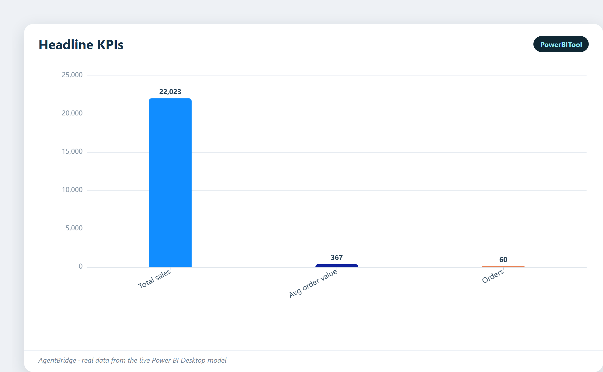
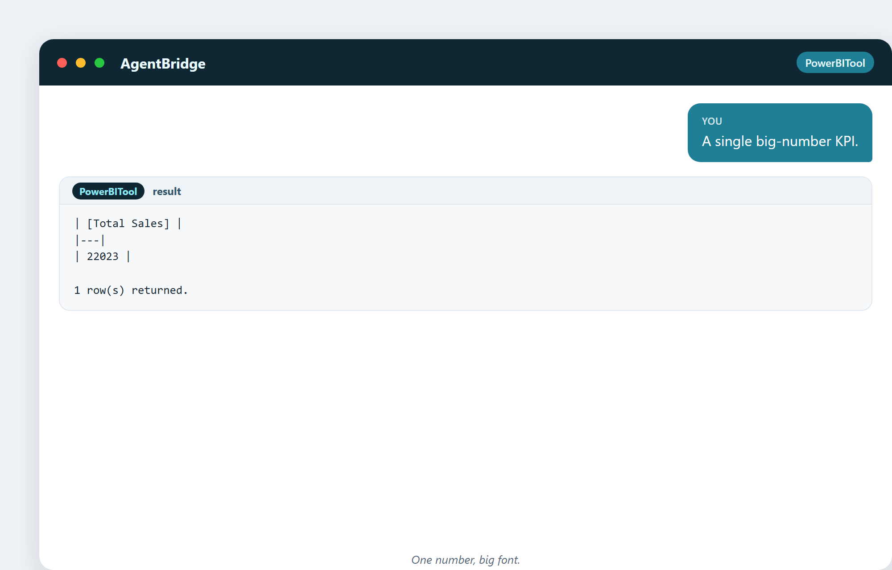
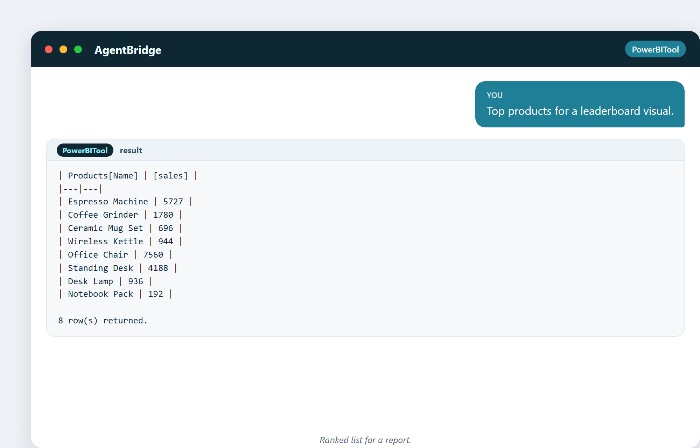

# 21. Отчёты и дашборды, которыми действительно пользуются

Дашборд, который никто не открывает, — провал, каким бы красивым он ни был. Эта
глава о том, чтобы строить отчёты, на которые люди действительно смотрят,
доверяют им и действуют по ним, — и о том, как ассистент готовит числа, что на
них попадают.

## Дашборд против отчёта — это не одно и то же

- **Дашборд** — одна страница важнейших чисел, рассчитанная на чтение одним
  взглядом. Думайте: спидометр и датчик топлива в машине.
- **Отчёт** — более глубокое, многостраничное исследование, в которое можно
  проваливаться. Думайте: руководство владельца, которое листаешь, когда что-то не
  так.

Обоим есть место. Дашборд отвечает «как у нас прямо сейчас?»; отчёт отвечает
«давай копнём почему».

## Строка KPI: верх каждого хорошего дашборда

Большинство отличных дашбордов открываются строкой крупных чисел — горсткой KPI,
что важнее всего. Ассистент может построить эту строку одной просьбой:

> «Набор KPI: общие продажи, заказы, средний чек.»

Три числа, готовые для трёх карточек KPI через верх. Это первое, что читает
занятый руководитель, так что это должны быть правильные три числа.

Те же KPI, нарисованные сравнительной диаграммой:

> «Компактная строка KPI для верха отчёта.»

Та же идея, другой набор — какие бы ни были ваши толайновые метрики.

## Одно большое число

Иногда одно число — вся история:

> «Одна крупночисловая KPI.»

Карточка большого числа — дашбордовый эквивалент заголовка. Используйте её для
той единственной метрики, о которой все заботятся.

## Таблица лидеров

Люди обожают рейтинг. Список топ-N двигает действия и маленькое дружеское
соперничество:

> «Топ товаров для визуала-таблицы лидеров.»

Ранжированный список, готовый для визуала-таблицы лидеров. Низ списка — где
проблемы; верх — где удвоить усилия.

Таблица лидеров, нарисованная диаграммой:

## Что делает дашборд удобным

- **Мало чисел, крупных и ясных.** Один взгляд должен рассказывать историю.
- **Правильные числа.** Те, что движутся вместе с бизнесом (глава 11).
- **Последовательный.** Те же метрики, те же цвета, та же раскладка каждый раз, —
  чтобы люди научились его читать.
- **Живой.** Обновляется автоматически, так что всегда актуален.
- **Честный.** Никаких обрезанных осей, никаких метрик тщеславия.

## Принцип проваливания

Хороший дашборд показывает сводку и даёт **провалиться в деталь**, когда она
нужна. Вы видите «Север просел» на дашборде, кликаете — и отчёт показывает,
какие магазины, какие товары, какие дни. Сначала сводка, деталь по требованию —
никогда не закапывайте читателя в деталь заранее.

## Любопытный факт: правило кабины

Пилоты не хотят больше приборов; они хотят *правильные* приборы в *правильном*
месте. То же правило правит дашбордами. Знаменитый принцип дизайна гласит: хороший
дашборд отвечает на ваш важнейший вопрос **без того, чтобы вы спрашивали**, — нужное
число уже там, крупное, актуальное и честное. Если вам приходится охотиться или
кликать, чтобы найти то, что вы проверяете каждое утро, дашборд не готов.

## Роль ассистента в дашборде

Ассистент строит **числа** — меры и KPI, что питают каждую карточку и диаграмму.
Вы раскладываете их на холсте. Это разделение труда — сладкая точка: ассистент
разбирается с вычислением и проверкой; вы разбираетесь с историей и раскладкой.

---

## Что вы унесёте из этой главы

- Дашборд — это взгляд; отчёт — это проваливание в деталь.
- Открывайте строкой KPI из немногих важных чисел.
- Используйте карточки больших чисел и таблицы лидеров для фокуса.
- Удобный = мало, верно, последовательно, живо, честно.
- Ассистент строит числа; вы строите историю.

Часть IV закончена — вы можете подключаться, моделировать, вычислять и
визуализировать. Теперь финальный акт: агентная революция, связывающая всё вместе,
и ваше место в ней.
